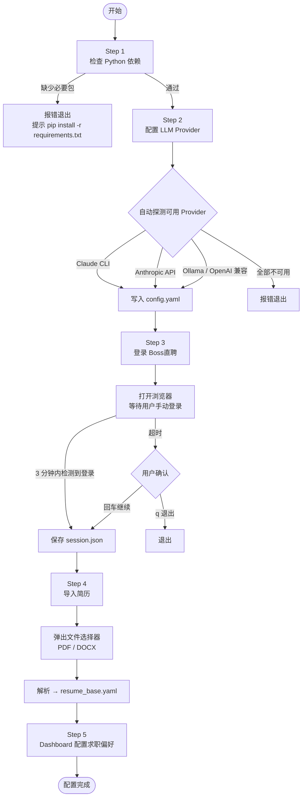
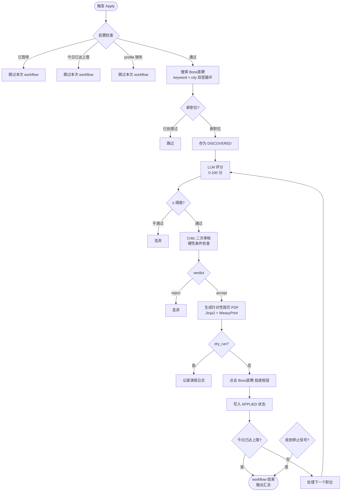
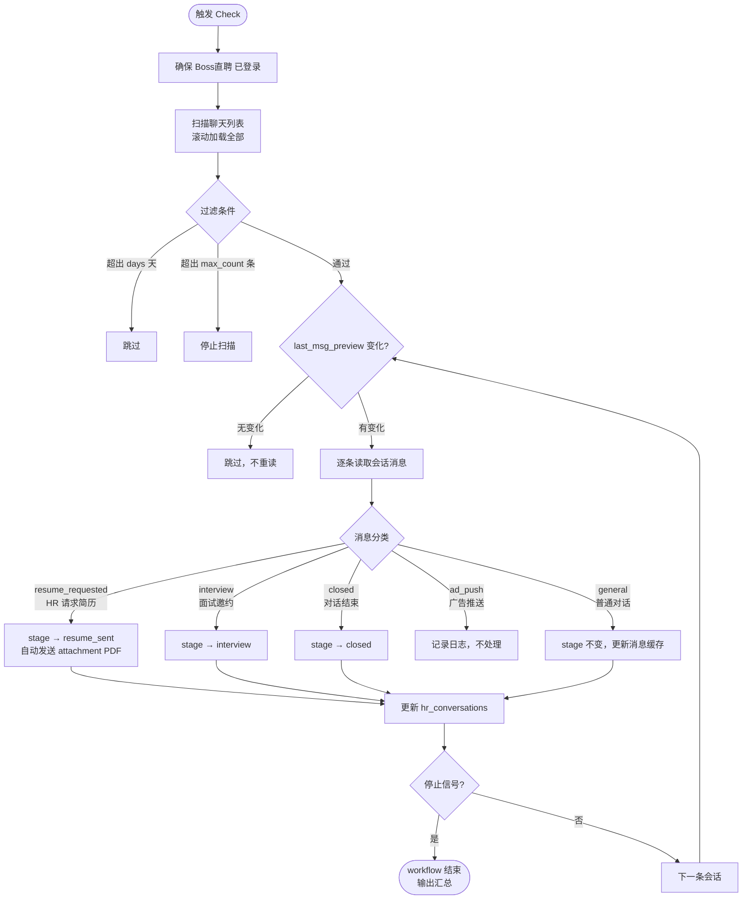

# OpenJobFinder — 产品需求文档（PRD）

> **版本**：v1.0 · **日期**：2026-04-02 · **作者**：内部参考文档

---

## 产品概述

OpenJobFinder 是一个基于 Playwright 的 Boss直聘 自动化求职 Agent。它把"找工作"这件事拆成三个连续的 Workflow，覆盖从账号配置到自动投递再到 HR 回复跟进的完整闭环。

```
Workflow 1            Workflow 2                     Workflow 3
Onboarding     →      Apply（搜索 + 投递）     →      Check（回复跟进）
（一次性配置）          （每日定时执行）                  （每小时执行）
```

---

## 用户

只有一个用户：求职者本人。整个系统是单用户、本地运行的 Agent，不涉及多租户。

---

## 核心数据：求职状态机

Apply Workflow 驱动的核心状态机（持久化在 SQLite `jobs.db`）：

```
DISCOVERED → SCANNED → SCORED ──(分数不足)──→ [丢弃]
                                 │
                            (分数通过)
                                 ↓
                            SCORED + Critic ──(Critic 拒绝)──→ [丢弃]
                                 │
                            (Critic 通过)
                                 ↓
                            生成简历 → APPLIED → RESPONDED → INTERVIEW → OFFER
                                                            ↘ REJECTED
```

HR 会话独立维护状态（`hr_conversations` 表）：

```
general → resume_sent → interview → closed
```

---

## Workflow 1：Onboarding（环境初始化）

### 定位

一次性配置流程。首次使用前必须完整走完，之后不需要重复。

### 触发方式

```bash
python main.py --onboarding
```

### 流程图



### 步骤详解

| Step | 操作 | 成功产物 |
|------|------|----------|
| 1. 检查依赖 | 验证必要包（DrissionPage、PyYAML、requests、jinja2）和 Chrome 可用性 | — |
| 2. 配置 LLM | 按优先级探测：Claude CLI → Codex CLI → Anthropic API → OpenAI 兼容 → Ollama | `config.yaml` 中写入 providers |
| 3. 登录 Boss直聘 | 打开浏览器到登录页，检测 URL 跳转判断登录成功，保存 Playwright session | `data/session.json` |
| 4. 导入简历 | 弹出文件选择器，用户选 PDF 或 DOCX，Agent 解析结构化内容 | `data/resume_base.yaml` |
| 5. 配置求职偏好 | 在 Dashboard → 求职偏好页填写 keywords / cities / salary / experience 等 | `data/profile.yaml` |
| 6. 上传附件简历 | 在 Dashboard → 环境配置页上传 PDF（用于 HR 请求时自动发送） | `data/resume_attachment.pdf` |

### 验收标准

- `check_all()` 返回 `profile: true, resume: true, session: true, llm_provider: true`
- Dashboard 顶部状态栏无红色警告
- `python main.py --dry-run` 能跑通不报错

---

## Workflow 2：Apply（搜索与投递）

### 定位

主业务流程。每次执行完成一轮"搜索 → 评分 → 审核 → 生成简历 → 投递"闭环。

### 触发方式

| 方式 | 命令 |
|------|------|
| 手动单次 | Dashboard "开始投递" 按钮，或 `python main.py --once` |
| 定时自动 | 工作日每天 9:00 AM（APScheduler） |
| 演练模式 | `python main.py --dry-run`（跳过实际投递） |

### 流程图



> 停止检查点分布在：keyword 循环入口、city 循环入口、职位处理循环每轮开头。

### 步骤详解

**search（搜索）**
- 遍历 `profile.yaml` 中的 `keywords × cities` 组合
- 附加筛选参数：experience、degree、salary、scale、job_type、boss_online
- 新职位存为 `DISCOVERED`，已有记录直接跳过（幂等）

**score（LLM 评分）**
- 先抓取 JD 正文（`SCANNED`）
- LLM（scoring chain）对比 JD 与用户 profile，输出 score（0-100）和 decision
- `score < score_threshold` 或 `decision = "skip"` → 直接丢弃

**critique（Critic 审核）**
- 第二个 LLM 调用，只看硬性不匹配：城市不符、经验差距极大、完全无关方向
- 宽松模式：只拒绝明显不符，不过度苛刻
- `verdict = "reject"` → 丢弃；`verdict = "accept"` → 继续

**resume（生成简历）**
- 基于 `resume_base.yaml` + JD 评分结果，生成针对性 PDF
- WeasyPrint 未安装时跳过此步，不阻断投递

**apply（投递）**
- 点击 Boss直聘 职位页的投递按钮（`.op-btn-chat`）
- 成功后写入 `APPLIED` + `applied_at`
- `dry_run = true` 时记录日志但不实际点击

### 关键参数

| 参数 | 来源 | 默认值 | 说明 |
|------|------|--------|------|
| `score_threshold` | `profile.yaml` → `config.yaml` | 60 | 低于此分值丢弃 |
| `daily_limit` | `config.yaml` | — | 每日最大投递数 |
| `limit_per_run` | `config.yaml` → `job_search.limit_per_run` | 30 | 每次搜索最多抓取数 |
| `boss_online` | `profile.yaml` | false | 只显示 Boss 在线职位 |
| `dry_run` | CLI flag | false | 演练模式，不实际投递 |

### 验收标准

- 搜索结果正确存入 `DISCOVERED`，已处理职位不重复处理
- score < threshold 的职位不进入投递环节
- dry-run 模式下 `applied_count = 0`，但 `processed_count > 0`
- 停止按钮触发后，当前职位处理完毕即停止（不强杀）
- 每日达到 `daily_limit` 后自动停止

---

## Workflow 3：Check（回复跟进）

### 定位

维护 HR 会话关系。每小时自动执行，把新消息同步到本地，自动处理简历请求。

### 触发方式

| 方式 | 命令 |
|------|------|
| 手动 | Dashboard "开始检查" 按钮，或 `python main.py --check` |
| 定时自动 | 每小时一次（APScheduler） |

### 流程图



### 步骤详解

**扫描聊天列表（scan）**
- 打开 Boss直聘 消息页，滚动加载所有会话
- 对每条会话提取：hr_name、company、last_msg_preview、timestamp
- 脏检查：`last_msg_preview` 与本地缓存一致则跳过，节省操作次数

**消息读取与分类（classify）**
- 进入每个有变化的会话，读取近期消息
- 识别三类简历请求（A：系统通知；B：HR 卡片；C：HR 文本）
- 同时识别面试邀约关键词 → 更新 stage

**简历发送（send_attachment）**
- 检测到 `resume_requested` 且 stage 尚未是 `resume_sent`
- 三策略顺序尝试：① 点卡片"同意"；② 点 toolbar"发简历"按钮；③ 文件上传 fallback
- 境外公司有二次确认弹窗，自动处理

**状态更新（update_status）**
- `hr_conversations` 表写入最新 stage 和 last_msg_preview
- 应聘记录（`applications` 表）同步更新 status → `RESPONDED` / `INTERVIEW`

### 关键参数

| 参数 | 来源 | 默认值 | 说明 |
|------|------|--------|------|
| `check_responses_days` | `config.yaml` | 7 | 只看最近 N 天内的会话 |
| `check_responses_max` | `config.yaml` | 200 | 单次最多处理 N 条会话 |
| `aggressive_resume` | `config.yaml` | false | 无 me 消息时也主动打招呼并发简历 |

### 验收标准

- 已读/无变化的会话不重复处理（脏检查生效）
- HR 请求简历后，`stage` 在下次 Check 后变为 `resume_sent`
- `attachment_resume.pdf` 不存在时，跳过发送并记录警告，不崩溃
- 停止按钮触发后，当前会话处理完毕即停止

---

## 跨 Workflow 约束

### Session 共享

三个 Workflow 都依赖 `data/session.json`。Session 失效时抛出 `SessionExpiredError`，Workflow 立即中断并在 Dashboard 显示错误状态。恢复方式：重新运行 Onboarding 的 Step 3。

### 每日投递上限

`daily_limit` 只约束 Workflow 2。Workflow 3 的发简历操作不计入此限制。

### 停止机制

Dashboard 停止按钮 → `POST /api/workflow/stop` → 设置 `emitter.stop_requested = true`。每个 Workflow 在各自的循环入口检查此标志，当前操作完成后再停止（不强杀浏览器进程）。

无 Workflow 运行时点击停止，server 返回 `{"ok": false}`，前端立即恢复 UI 状态。

### dry_run 模式

只对 Apply Workflow 有效。搜索、评分、Critic、简历生成全部执行，只跳过实际投递点击。用于验证全流程配置是否正确。

---

## 已知限制

| 限制 | 影响 | 状态 |
|------|------|------|
| WeasyPrint 未安装 | 简历 PDF 无法生成，投递时无附件简历 | 待安装 |
| `_send_chat_message` 输入框选择器未验证 | aggressive_resume 模式的"打招呼"步骤可能失效 | 待验证 |
| aggressive_resume 端到端未跑通 | 仅在有未回复会话时可测试 | 待验证 |
| 未读 badge selector 未验证 | 脏检查依赖 last_msg_preview，badge 仅用于辅助 | 待验证 |
