# OpenJobFinder 源码导读教程（TUTORIAL）

> 面向：想读懂这套代码、学习它怎么实现的人。
> 版本基线：`v2.0.1.21` 工作区（最近提交 `fdc03be` 时间点）。
> 阅读方式：每章带**真实代码片段 + `文件:行号`**，建议对照源码一起看。行号会随代码演进漂移，以函数名/类名为准。
>
> 本教程是**贯通全局的学习总纲**。更细的专题另见：
> - 浏览器层收敛史 → [`browser-session-convergence.md`](browser-session-convergence.md)
> - 配置三层模型 → [`configuration.md`](configuration.md)
> - 前端架构 → [`frontend.md`](frontend.md)

---

## 目录

1. [全景：这套系统是什么](#1-全景这套系统是什么)
2. [后端四层架构（tools / pipeline / services / dashboard）](#2-后端四层架构)
3. [一次请求的完整生命周期：W1 投递走一遍](#3-一次请求的完整生命周期w1-投递走一遍)
4. [浏览器自动化层（DrissionPage）](#4-浏览器自动化层drissionpage)
5. [LLM 层（ModelRouter + FallbackChain）](#5-llm-层modelrouter--fallbackchain)
6. [数据库层（SQLite tracker 状态机）](#6-数据库层sqlite-tracker-状态机)
7. [W2 / W3 深入（会话扫描、意图守门、审批→发送闭环）](#7-w2--w3-深入)
8. [前端 SPA（React + SSE live + 工作流监控 + 日志回放）](#8-前端-spareact--sse-live--工作流监控--日志回放)
9. [可观测性 + 配置三层模型 + 自检 / 简历模块](#9-可观测性--配置三层模型--自检--简历模块)

---

## 1. 全景：这套系统是什么

OpenJobFinder 是一个**自动化求职 Agent**：它驱动一个真实的 Chrome 浏览器登录 Boss直聘，按你的求职偏好搜职位、用 LLM 打分决定要不要投、自动投递；并持续同步 HR 会话、分析对方意图、按需发简历、把你审批过的回复发出去。所有过程通过一个本地 Dashboard（FastAPI + React）实时可视化。

### 1.1 五个功能（navigator）

前端侧边栏有 8 个导航页（`dashboard/frontend/src/pages/`），核心是**三条工作流 + 两个独立模块**：

| 功能 | 代号 | 入口页 | 干什么 |
|------|------|--------|--------|
| 投递 | **W1** | 控制台 `Dashboard.tsx` | 搜索 → 分类 → 抓 JD → LLM 评分 → 超阈值则投递 → 落库 |
| 检查回应 | **W2** | 控制台 / 会话 `Chat.tsx` | 扫会话列表 → 逐会话读消息 → LLM 分析意图 → 按需发简历 → 草拟回复 → 落库 → 收尾 |
| 发送回复 | **W3** | 会话 `Chat.tsx` | 把你**审批过**的回复定位会话发出，重扫验证落地 |
| 自检 | — | 自检 `SelfCheck.tsx` | 三探针（浏览器+登录态 / DB / LLM）+ 可真跑一轮 W1/W2 |
| 简历 | — | 简历 `Resume.tsx` | 简历解析成可排列组合的段落块，岗位定制简历/招呼语，Chromium 导出 PDF |

其余导航页：职位 `Jobs.tsx`（投递记录表）、日志 `Logs.tsx`（run 回放）、自动化 `Automation.tsx`（定时调度）、设置 `Settings.tsx`（配置 / Provider / 求职偏好）。

> **为什么拆成 W1/W2/W3 三条而不是一条**：投递、检查、发回复三件事的**触发时机和风险等级完全不同**。W1/W2 可以无人值守自动跑（投递和读消息都不可逆性低），但 W3 会**以你的名义给 HR 发消息**——所以 W3 设计成**只能手动触发**，且发送内容必须先经你在会话页审批。这条边界贯穿整个代码：自检和"全流程"都**只串 W1→W2，绝不含 W3**。

### 1.2 一张总架构图

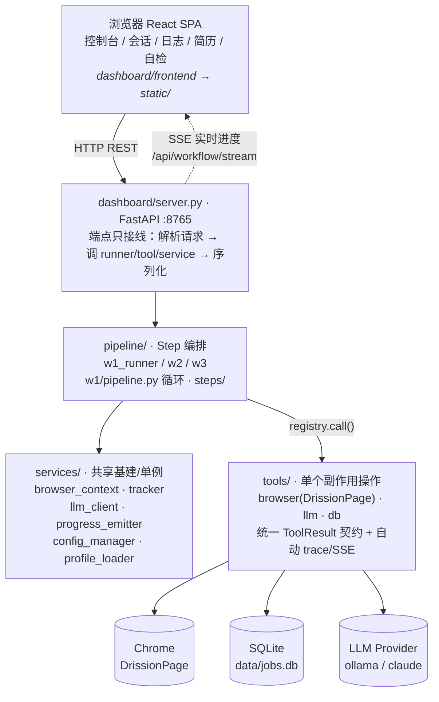

四层的职责判据（详见第 2 章 + `CLAUDE.md`「后端分层约定」）：

- **`tools/`** — 一次对外部系统的副作用操作（碰浏览器/DB/LLM）。经 `registry.call` 调用，返回统一的 `ToolResult`，自动产生 trace + SSE。
- **`pipeline/`** — 把多个 tool 编排成一条工作流的一个阶段（Step 模式）。
- **`services/`** — 被多处共用的基建/单例（浏览器会话、tracker、llm_client、配置）。
- **`dashboard/server.py`** — 只做 HTTP 接线，**不准内联**浏览器/LLM/业务逻辑。

> **铁律**：端点绝不内联副作用，必须委托给 tool/step/service。违反它会立刻制造两份分叉实现（加固一个漏一个）+ 绕开 registry 就没 trace/SSE。这条教训有血泪史（交互端点曾内联遗留 BrowserAgent，与流水线的 VerifySessionStep 分叉，导致 session 校验误报"过期"）。

### 1.3 三个外部依赖

- **Chrome（DrissionPage 驱动）**：登录态存在 `data/browser_profile/`（Chrome 的 user-data 目录），不是某个 session.json。判断是否登录的唯一权威是跑 `VerifySessionStep`。
- **SQLite `data/jobs.db`**：三张表 `applications` / `hr_conversations` / `hr_messages`。所有状态持久化在这，崩溃可续跑。
- **LLM Provider**：通过 `ModelRouter` + FallbackChain 抽象，按 capability（fast/balanced/powerful）路由到 claude_cli / ollama / anthropic_api / openai_compatible。

---

## 2. 后端四层架构

第 1 章给了四层的全貌，这一章讲清楚**每层的边界判据**（一段新代码到底该放哪）、**为什么必须这么分**，以及把四层粘起来的 `ToolRegistry`。这套分层是项目的宪法，`CLAUDE.md` 里专门有「后端分层约定」一节。

### 2.1 四层与判据

| 层 | 放什么 | 一句话判据 | 代表文件 |
|----|--------|-----------|---------|
| `tools/` | 对外部系统的**单个副作用操作**（浏览器/DB/LLM）。经 `registry.call` 调，返回 `ToolResult`，自动 trace/SSE | "是不是一次碰浏览器/DB/LLM 的活儿" | `tools/browser/w1/click_apply_button.py`、`tools/llm/score_job.py`、`tools/db/w1/upsert_application.py` |
| `pipeline/`（Step） | 把多个 tool 编排成**工作流的一个阶段** | "是不是某条工作流里的一段" | `pipeline/w1/steps/apply.py`、`pipeline/w1/pipeline.py` |
| `services/` | **被多处共用的基建/单例** | "是不是多处共用的基建" | `services/tracker.py`、`services/llm_client.py`、`services/browser_context.py` |
| `dashboard/server.py` | **只做 HTTP 接线**：解析请求 → 调 tool/step/service → 序列化返回 | —— | `dashboard/server.py` |

### 2.2 「这段代码该放哪」决策树

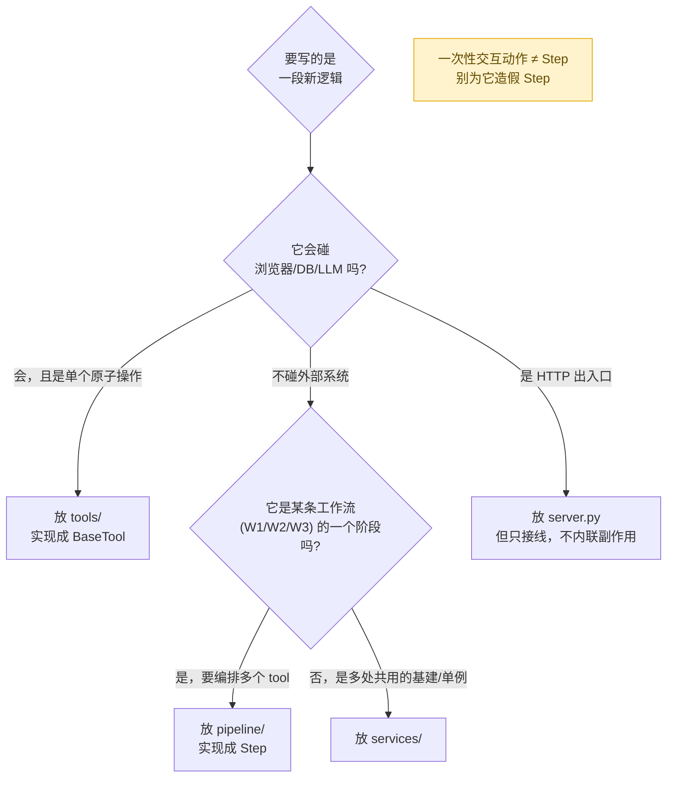

### 2.3 ToolRegistry：把四层粘起来的那一层

四层不是各写各的，靠 `ToolRegistry`（`tools/registry.py`）串起来。它一身三职：

1. **依赖容器**：持有这次 run 的 `browser` / `db` / `llm_client` / `prompt_manager`（第 3 章 `run_w1` 里 `ToolRegistry(browser=page, db=tracker, ...)` 就是在建它）。
2. **调用中枢**：所有 tool 都通过 `registry.call(name, **kwargs)` 调，不直接 new 出来调。
3. **观测注入点**：`call` 自动给每次调用计时、记 trace、推 SSE（第 3.6 节详解）。这是"绕开 registry 就没 trace/SSE"的技术根。

所以**层与层之间不直接互相 import 调用**——Step 不直接 import 某个 tool 类，而是 `self._reg.call("click_apply_button", ...)` 按名字调。tool 在 run 开始时被注册进 registry（`register_w1_browser_tools`），名字是唯一引用。这层间接换来了统一观测和可替换性。

### 2.4 铁律：端点不准内联副作用

这是分层约定里**唯一用"铁律"措辞**的一条，因为它有血泪史。

> 端点（`server.py` 里的 `@app.post/get`）绝不内联浏览器/LLM/业务逻辑，必须委托给 tool/step/service。

违反它的代价是**双重**的：

1. **必然制造两份分叉实现**：同一件事（比如"验证登录态"）端点写一份、流水线写一份，以后加固一个会漏掉另一个。真实事故：交互端点曾内联遗留的 `BrowserAgent` 来验证 session，和流水线用的 `VerifySessionStep` 分叉了，结果两者判断不一致，导致 session 校验误报"过期"，害人反复重登。这次收敛的完整论证见 [`browser-session-convergence.md`](browser-session-convergence.md)。
2. **不可观测**：绕开 `registry.call` 的操作不产生 trace/SSE，监控和日志里看不到，出问题无从排查。

所以正确的端点长这样（第 3 章的 `trigger_apply` 是范本）：解析 `body` → 调 `run_w1`（runner/step）→ 返回 JSON，自己**不碰浏览器一行**。

### 2.5 一个例外：纯读端点不强行 tool 化

分层不是教条。**纯读端点**（`GET /api/jobs`、`/api/stats` 等）直接调 `tracker` 序列化返回即可，不必包成 tool。

原因：tool 契约（`ToolResult` + trace + SSE）是为**流水线的可观测/可重放**设计的；仪表盘读数据用不上这些，硬包一层只剩仪式感。判据回到本质——**tool 化是为了让流水线里的副作用可观测**，一个无副作用的只读查询不在此列。

> 这条例外本身也呼应全局原则「simplicity first」：分层是为了解决真问题（分叉 + 不可观测），不是为了形式整齐。哪里没有那两个问题，就不必上重型契约。

---

## 3. 一次请求的完整生命周期：W1 投递走一遍

这一章是全教程的核心。我们跟着一次「点击控制台『开始投递』按钮」的请求，从前端一路走到浏览器/LLM/DB，再把进度实时推回前端。看懂这一条，整套系统的骨架就通了。

全链路概览（每一跳都标了文件）：

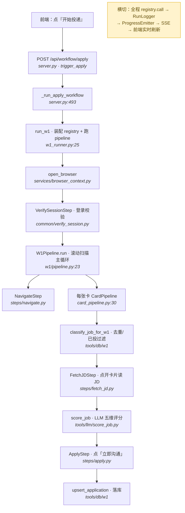

### 3.1 第 0 跳：端点只做接线（顺带防一个并发坑）

`dashboard/server.py:2064`：

```python
@app.post("/api/workflow/apply")
async def trigger_apply(background_tasks: BackgroundTasks, body: dict | None = None) -> JSONResponse:
    _initialize_state()
    body = body or {}
    emitter: ProgressEmitter = app.state.emitter
    if emitter.current_workflow:
        raise HTTPException(status_code=409, detail="已有 workflow 正在运行")
    # Set immediately to close the race window between this check and start_workflow()
    emitter.current_workflow = "w1"          # ← 立刻占坑，防并发双触发
    ...
    background_tasks.add_task(_run)           # ← 真正的活丢到后台任务
    return JSONResponse({"status": "started"})
```

三个要点：

1. **端点立即返回 `{"status":"started"}`**，不阻塞 HTTP 请求。真正耗时几分钟的浏览器操作丢进 `BackgroundTasks`（`_run`）后台跑。
2. **并发互斥**：`emitter.current_workflow` 是全局单工作流锁。这里**先 check 再立刻占坑**——注释点明这是为了关闭 check 与后台任务里 `start_workflow()` 之间的竞态窗口，否则连点两下会起两个浏览器互相打架。
3. **端点不碰浏览器**。它只解析 `body` 里的参数（`max_cards`/`score_threshold`/`dry_run`...），委托给 `_run_apply_workflow`。这就是「端点只接线」铁律的体现。

参数怎么解析（`server.py:2077`）：前端只传它显式给的键，缺省值交给 `resolve_params` 按 W1 默认填（配置三层模型，见第 9 章）。`max_cards` 还兼容了旧键名 `apply_limit`，`0/缺省 → None`（表示不限）。

### 3.2 第 1 跳：runner 组装"一次性运行时"

`_run_apply_workflow`（`server.py:493`）很薄，主要是用 `resolve_params` 把三层配置合并成最终参数，然后调 `run_w1(...)`，把 4 个**单例**注入进去：

```python
run_w1(
    config=app.state.config,
    tracker=app.state.tracker,            # SQLite 状态机（service 单例）
    model_router=app.state.model_router,  # LLM 路由（service 单例）
    emitter=getattr(app.state, "emitter", None),  # SSE 总线（service 单例）
    dry_run=..., score_threshold=..., max_cards=..., headless=..., data_dir=DATA_DIR,
)
```

`run_w1`（`pipeline/w1_runner.py:25`）是 W1 的**装配车间**——`main.py --once` 和 Dashboard 共用这一个入口。它干 6 件事（按 try 块顺序）：

```python
# 5. 通知 emitter：工作流开始（这一步让前端 SSE 切到 w1 tab）
if emitter is not None:
    emitter.start_workflow("w1")                    # w1_runner.py:79

run_logger = RunLogger(pipeline="w1", emitter=emitter, debug=debug)  # :84

try:
    # 6. 开浏览器
    page = open_browser(data_dir, headless=headless)               # :88

    # 6b. 动任何东西之前，先验登录态
    session = VerifySessionStep(page).run()                        # :91
    if session.status != session.status.SUCCESSFUL:
        if session.error == "session_expired":
            raise RuntimeError("Boss session expired — please re-login: ...")
        raise RuntimeError("session verify failed (browser/page error, ...)")

    # 7. 建 registry（持有 4 个共享资源 + run_logger）
    registry = ToolRegistry(browser=page, db=tracker,
                            llm_client=model_router, prompt_manager=prompt_manager)  # :102
    registry.logger = run_logger

    # 8. 注册工具（把 tool 类实例挂进 registry）
    register_w1_browser_tools(registry, page)                      # :112
    register_w1_tools(registry, tracker, model_router, prompt_manager, ...)  # :113

    # 9. 跑流水线
    pipeline = W1Pipeline(registry=registry, profile=profile, logger=run_logger)  # :116
    summary = pipeline.run(W1Config(url=search_url, score_threshold=..., dry_run=..., max_cards=...))
finally:
    if page is not None:
        close_browser(page)                                       # :134

# 10. 通知 emitter：工作流结束
if emitter is not None:
    emitter.finish_workflow("w1", str(summary), status="done")    # :139
```

几个值得停下来看的设计：

- **「先验登录再干活」（`:91`）**：每次 run 都先跑 `VerifySessionStep`（访问 `geek/recommend` 读 `window._PAGE.name`）。注意错误分流：确认登出 → `session_expired`（让你去重登），其它（浏览器/页面抖动）→ 明确说"不一定是登出"。这个区分是踩坑换来的——以前一律报"session invalid"，害人空跑去重登。
- **`registry` 是这次 run 的"依赖容器"**：它持有浏览器 page、tracker、llm、prompt_manager，外加一个 `run_logger`。所有 tool 通过它调用，于是**每个 tool 调用都自动被 logger 记录**（见 3.6）。
- **`finally: close_browser`**：无论成功失败都关浏览器，不泄漏 Chrome 进程。
- **`start_workflow` / `finish_workflow` 是前端能看到这次 run 的关键**（3.6 详解）。注意：**定时任务、自检走的是同一个 `run_w1`**，所以它们的进度同样会推到前端——这就是为什么"定时任务正在跑也能在控制台看到 live log"，线本来就接着。

### 3.3 第 2 跳：W1Pipeline —— 滚动扫描主循环

`pipeline/w1/pipeline.py:23`。结构是「先导航，再 while 循环：扫一屏卡 → 逐张处理 → 滚动加载下一屏」。

```python
def run(self, config: W1Config) -> dict:
    nav = NavigateStep(self._reg).run(url=config.url)        # 导航到搜索结果页
    if nav.status != StepStatus.SUCCESSFUL:
        self._logger.close("failed")
        return {"cards_viewed": 0, "applied": 0, "skipped": 0, "error": "navigate_failed"}

    seen_job_ids = set()        # 去重：同一职位在滚动中会重复出现
    consecutive_skips = 0       # 连续跳过计数（止损用）
    ...
    while True:
        self._reg.set_context("scan", {})
        page_check = self._reg.call("verify_current_url", expected_url=config.url)  # :39 防页面漂移
        if not page_check.ok:
            self._logger.log("page_drift_detected", ...); break

        cards = self._reg.call("extract_card_list").data.get("cards", [])           # :53 抓当前一屏卡
        if not cards and not seen_job_ids:
            self._logger.log("no_cards_found", ...); break

        new_cards = [c for c in cards if c["job_id"] not in seen_job_ids]
        self._logger.log_step(step="scan", ..., data={"card_count": ..., "new_card_count": ...})

        for card_data in new_cards:                                                 # :70 逐张处理
            seen_job_ids.add(card_data["job_id"]); cards_viewed += 1
            card_input = CardInput(job_id=..., title=..., company=..., card_dom_index=...)
            output, stop = CardPipeline(self._reg, self._profile, self._logger,
                                        config, db_failures).run(card_input)        # :84 ← 单卡子流水线

            if output.status == StepStatus.SKIPPED:        skipped += 1; consecutive_skips += 1
            elif output.status in (SUCCESSFUL, DEGRADED):  applied += 1; consecutive_skips = 0
            else:                                          consecutive_skips += 1

            if stop:                       should_stop = True; break   # 限流/达上限
            if consecutive_skips >= 5:     break                       # 连跳 5 张 → 这屏没料了
            if config.max_cards and cards_viewed >= config.max_cards:  should_stop=True; break

        if should_stop: break
        scroll = self._reg.call("scroll_search_results", current_card_count=len(seen_job_ids))  # :110
        if not scroll.ok or scroll.data.get("reached_end"): break

    summary = {"cards_viewed": ..., "applied": ..., "skipped": ..., "db_write_failures": len(db_failures)}
    self._logger.close("done", summary=summary)
    return summary
```

读这段要抓住几个**健壮性机制**（都是真实坑换来的）：

- **`seen_job_ids` 去重**：Boss 是无限滚动 SPA，同一张卡在滚动中会反复出现在 DOM 里，必须按 `job_id` 去重，否则重复评分重复投。
- **每轮先 `verify_current_url`（`:39`）**：防"页面漂移"——投递点击有时会意外把页面导航走（比如误点进职位详情页），漂了就停，不在错误页上瞎操作。
- **三重止损**：`consecutive_skips >= 5`（连跳 5 张说明这片区域都不合适）、`max_cards`（用户设的上限）、`scroll reached_end`（滚到底了）。
- **`db_failures` 贯穿传递**：一个列表从这里穿到每张卡的 `CardPipeline`，落库失败时往里 append，最后汇总进 summary。这样"投了但没落库"会显式暴露，不会被悄悄吞掉（这是一个真实修复点：早期 DB 写失败无人知）。

### 3.4 第 3 跳：CardPipeline —— 单张卡的"分类→抓JD→评分→投递→落库"

`pipeline/w1/card_pipeline.py:30`。这是 W1 的业务核心，一张卡的命运在这决定。

```python
def run(self, card: CardInput) -> Tuple[StepOutput, bool]:
    scope = {"job_id": card.job_id, "company": card.company}

    # ① 分类：已投过/不符合的直接跳，省掉后面所有开销
    cls = self._reg.call("classify_job_for_w1", job_id=card.job_id)            # :34
    if cls.data.get("action") == "skip":
        self._logger.log_step("classify", scope, "skipped", ...)              # ← 关键：发 terminal step
        self._logger.log("job_skipped", scope=scope, data={"reason": "classify_skip"}, visible=True)
        return StepOutput(status=StepStatus.SKIPPED), False
    self._logger.log_step("classify", scope, "successful", ...)

    # ② 抓 JD：点开卡片右侧详情面板，读职位描述 + 解码薪资
    fetch = FetchJDStep(self._reg).run(card_dom_index=card.card_dom_index, job_id=card.job_id)  # :52
    if fetch.status != StepStatus.SUCCESSFUL:
        return fetch, False
    jd_text = fetch.jd_text; salary_decoded = fetch.salary_decoded

    # ③ 评分：阈值 <= 0 是「纯流程验证」捷径，跳过 LLM 直接投（省 token）
    if self._config.score_threshold <= 0:                                     # :58
        score = 0
        self._logger.log("job_scored", ..., data={"score": 0, "above_threshold": True})
    else:
        score_res = self._reg.call("score_job", job_id=..., jd_text=jd_text, profile=self._profile)  # :67
        if not score_res.ok:
            self._logger.log_step("apply", scope, "skipped", 0, {"reason": "llm_error"})
            return StepOutput(status=StepStatus.DEGRADED, error=score_res.error), False
        score = score_res.data["score"]
        self._logger.log("job_scored", ..., data={"score": score, "above_threshold": score >= ...})
        if score < self._config.score_threshold:                             # :99 分不够 → 跳
            self._logger.log_step("apply", scope, "skipped", 0, {"reason": "score_below", "score": score})
            return StepOutput(status=StepStatus.SKIPPED), False

    # ④ 投递：点「立即沟通」
    apply_out = ApplyStep(self._reg).run(dry_run=self._config.dry_run, scope=scope)  # :112
    result = apply_out.result

    # ⑤ 落库：只有确认真点成功（applied / already_chatting）才写 APPLIED
    if result in ("applied", "already_chatting"):                           # :122
        upsert = self._reg.call("upsert_application", job_id=card.job_id,
            url=f"https://www.zhipin.com/job_detail/{card.job_id}.html",
            title=..., status="APPLIED", score=score, applied_at=now)        # :125
        self._logger.log_step("upsert", scope, "successful" if upsert.ok else "failed", ...)
        if not upsert.ok:
            self._db_failures.append({"job_id": ..., "title": ..., "company": ...})  # 失败上报

    return apply_out, should_stop
```

设计精华：

- **分类前置（`①`）省钱**：`classify_job_for_w1` 是纯 DB 查（这职位投过没？），先把已投/重复的卡挡掉，避免白白抓 JD + 调 LLM。便宜的检查放前面，贵的操作（浏览器抓取、LLM）放后面。这是"code decides, models judge"的体现——"投没投过"是确定性事实，用代码判，不交给 LLM。
- **`score_threshold <= 0` 捷径（`③`）**：这是"纯流程验证"开关——想测投递链路通不通、又不想烧 LLM token 时，把阈值设 0，跳过评分直接投。前面几次会话里我们触发的 `threshold=0` W1 就是走这条。
- **"确认成功才落库"（`⑤`）**：`button_not_found` / `dialog_blocked` / `error` 都**不写库**，留到下次 run 重试；只有 `applied`（真点出成功弹窗）或 `already_chatting`（已有会话=之前投过）才记 `APPLIED`。这是幂等的根：DB 是唯一真相源，宁可漏记重试，不可错记。
- **满地的 `log_step(..., "skipped", ...)`**：每条跳过分支都补发一个 terminal step 事件。注释解释了原因——不发的话，前端循环明细里这个节点会停在"等待(pending)"圈圈，卡片徽章也错误地显示"等待"。这是监控可视化的一个真实修复（见第 8 章）。

### 3.5 第 4 跳：Step 与 Tool —— 副作用的最小单元

往下还有两层：**Step** 把"一个动作"封装好（含日志），**Tool** 真正碰浏览器/LLM/DB。

以最简单的 `ApplyStep`（`pipeline/w1/steps/apply.py:17`）为例——它就是"调一个 tool + 记一条 step 日志"：

```python
def run(self, dry_run: bool, scope: dict = None) -> ApplyStepOutput:
    self._reg.set_context("apply", scope or {})
    apply = self._reg.call("click_apply_button", dry_run=dry_run)   # ← 调 tool
    if not apply.ok:
        out = ApplyStepOutput(status=StepStatus.DEGRADED, error=apply.error, result="error")
        self._log_step(...); return out
    result = apply.data.get("result", "")
    if result == "rate_limited":                                    # 被限流 → should_stop
        return ApplyStepOutput(status=StepStatus.DEGRADED, result=result, should_stop=True)
    # 投递后总是清理成功弹窗：'applied' 清掉自己的，'dialog_blocked' 清掉残留的
    if result in ("applied", "dialog_blocked"):
        self._reg.call("handle_apply_dialog", action="close_and_wait")  # ← 再调一个 tool
    return ApplyStepOutput(status=StepStatus.SUCCESSFUL, result=result)
```

再往下一层是 tool 本身。`click_apply_button`（`tools/browser/w1/click_apply_button.py:33`）是个标准 `BaseTool`：

```python
class ClickApplyButton(BaseTool):
    name = "click_apply_button"
    def execute(self, dry_run: bool = False) -> ToolResult:
        if dry_run:
            return ToolResult(ok=True, data={"result": "dry_run"})       # 演练：不碰浏览器
        page = self._browser
        try:
            apply_btn = _ele_any(page, _APPLY_BTN_SELECTORS, timeout=3)  # 多选择器兜底找按钮
            if not apply_btn:
                return ToolResult(ok=True, data={"result": "button_not_found"})
            if "继续沟通" in (apply_btn.text or ""):
                return ToolResult(ok=True, data={"result": "already_chatting"})  # 已投过
            # 点击前若成功弹窗还在 → 上一张卡的弹窗没清，点了会撞它假阳性
            if _ele_any(page, _APPLY_SUCCESS_DIALOG_SELECTORS, timeout=0):
                return ToolResult(ok=True, data={"result": "dialog_blocked", "reason": "stale_success_dialog"})
            apply_btn.click()
            _human_pause(1.5, 2.5)                                       # 拟人停顿，反爬
            confirmed = _ele_any(page, _APPLY_SUCCESS_DIALOG_SELECTORS, timeout=5)
            return ToolResult(ok=True, data={"result": "applied" if confirmed else "dialog_blocked"})
        except Exception as exc:
            return ToolResult(ok=False, data={}, error=str(exc))
```

Tool 层的契约（`tools/base.py`）极简：

```python
@dataclass
class ToolResult:
    ok: bool
    data: dict = field(default_factory=dict)
    error: Optional[str] = None

class BaseTool(ABC):
    name: str
    @abstractmethod
    def execute(self, **kwargs) -> ToolResult: ...
```

注意 tool 怎么**区分"操作失败"和"业务结果"**：找不到按钮、已投过、弹窗挡住——这些都是 `ok=True` + `data["result"]=...`（操作本身成功执行了，只是结果是这个）；只有真抛异常才 `ok=False`。这个区分让上层能精确决策。那个 `stale_success_dialog` 检查是血泪史：一次 run 记了 10 个投递但实际只发出 1 个招呼，根因就是上一张卡的成功弹窗没清，下一张点击后撞上它假报"applied"。

**工具怎么进入 registry**？看注册函数 `tools/browser/w1/__init__.py:11`——就是把 7 个 tool 类实例化挂进去：

```python
def register_w1_browser_tools(registry, browser) -> None:
    for tool_cls in (VerifyCurrentUrl, NavigateSearchUrl, ExtractCardList,
                     ScrollSearchResults, ClickCardOpenPanel, ReadPanelJD,
                     ClickApplyButton, HandleApplyDialog):
        registry.register(tool_cls(browser=browser))
```

LLM tool 形态略不同，以 `score_job`（`tools/llm/score_job.py:45`）为例，它体现了"models judge, code decides"的拆分：

```python
class ScoreJob(BaseTool):
    name = "score_job"
    capability = "balanced"          # ← 路由到哪档 Provider
    def execute(self, *, job_id, title, company, jd_text, profile) -> ToolResult:
        prompt = self._pm.render("score_job", {...})            # 渲染 prompt 模板
        text, provider = self._llm.complete(prompt, system=..., capability=self.capability)
        parsed = safe_parse_json(text, required_fields={"dimensions": dict})  # 三层容错解析
        # ↓ LLM 只输出 5 个维度的独立分；加权求和是 Python 算的，不让 LLM 做整体判断
        dim_scores = {k: clamp(parsed["dimensions"][k]["score"]) for k in WEIGHTS}
        score = int(sum(dim_scores[k] * w for k, w in WEIGHTS.items()))
        return ToolResult(ok=True, data={"score": score, "dimensions": dim_scores,
                                         "reason": ..., "provider_used": provider})
```

`WEIGHTS`（skill 0.40 / experience 0.25 / city 0.15 / salary 0.10 / growth 0.10，和为 1.0）写死在代码里。**LLM 只负责每个维度打分（judge），加权汇总这个确定性计算交给 Python（decide）**——这样评分稳定可复现，不会因 LLM 一次"整体感觉"飘忽。

### 3.6 横切：registry.call 如何把每次调用变成可观测的 trace + SSE

前面所有 `self._reg.call(...)` 看着是普通函数调用，其实每一次都被 `ToolRegistry.call`（`tools/registry.py:51`）包了一层观测：

```python
def call(self, name: str, **kwargs) -> ToolResult:
    tool = self.get(name)
    start_ts = time.time()
    try:
        result = tool.execute(**kwargs)
    except Exception as exc:
        # tool 选择 fail-fast 抛异常时，这里补记一条 failed trace 再 re-raise
        if self.logger is not None:
            self.logger.log_tool(step=self._current_step, tool=name, status="failed",
                                 duration_ms=..., error=str(exc))
        raise                                          # 不吞异常，保持 fail-fast
    duration_ms = int((time.time() - start_ts) * 1000)
    if self.logger is not None:
        status = "successful" if result.ok else "failed"
        log_data = {k: v for k, v in (result.data or {}).items() if k not in _LARGE_FIELDS}  # 砍大字段
        self.logger.log_tool(step=self._current_step, tool=name, scope=self._current_scope,
                             status=status, duration_ms=duration_ms, data=log_data, error=result.error)
    return result
```

每次 call 自动：① 计时；② 记一条 tool trace（带当前 step + scope）；③ 异常也记录再抛（不破坏 fail-fast）；④ `_LARGE_FIELDS`（`jd_text`/`messages`/`cards`...）从日志里剔掉，免得日志爆炸。

`step` 和 `scope` 哪来的？`registry.set_context(step, scope)`（`tools/registry.py:42`）。各 Step 在干活前调它登记"我现在在哪个阶段、处理哪个对象（job_id/conv_id）"，于是后续 tool trace 自动带上归属。它还顺手发一个 `running` SSE 事件，让前端树能显示"正在进行"的中间态。

观测信号最终分两路（`pipeline/run_logger.py`）：

```python
def log_tool(self, step, tool, scope, status, duration_ms, data=None, error=None):
    self._inner.log_tool(...)                          # ① 写持久化 JSONL（落盘，run 的完整真相源）
    if self._emitter is not None and self._debug:      # ② 推 SSE（仅 debug 模式逐 tool 推）
        self._emitter.emit(ProgressEvent(workflow=self._pipeline, step=step, tool=tool,
                                         status=_ui_status(status), ...))
```

- **落盘 JSONL**（`logs/runs/w1_YYYYMMDD_HHmm.jsonl`）是这次 run 的**完整、权威记录**，事后能在「日志」页回放（`/api/runs/{id}/events`）。
- **SSE** 是实时直播，经 `ProgressEmitter` 扇出给所有订阅的浏览器。注意 `_ui_status` 这个映射：文件日志用领域词（successful/failed/degraded）保留分析精度，但前端类型只认 `done/error/skipped`，所以推 SSE 时翻译一下，否则前端会把 `successful` 当未知值渲染成"等待"。

### 3.7 第 5 跳：进度怎么回到前端（SSE 闭环）

`ProgressEmitter`（`services/progress_emitter.py`）是个发布-订阅总线：

```python
def start_workflow(self, workflow: str) -> None:
    self.current_workflow = workflow
    self._buffers[workflow] = []                        # 新 run → 清掉该 workflow 的回放缓冲
    self.emit(...)

def emit(self, event: ProgressEvent) -> None:
    buf = self._buffers.setdefault(event.workflow, [])
    buf.append(event)
    if len(buf) > self._buffer_max:                     # 上限 200，超了丢旧的
        del buf[: len(buf) - self._buffer_max]
    for q in self._queues:
        try:
            q.put_nowait(event)                         # 非阻塞扇出
        except queue.Full:
            pass                                        # 实时展示可丢，不能卡住 pipeline
```

前端通过一个 EventSource 订阅（`dashboard/frontend/src/hooks/useWorkflowStream.ts`）：

```ts
const es = new EventSource('/api/workflow/stream')
es.addEventListener('message', (event) => {
  onEventRef.current(JSON.parse(event.data) as ProgressEvent)
})
```

`App.tsx` 收到事件后：把事件缓冲进 ref（~5Hz 批量刷新，防洪水重渲染），并在 `step==='start'|'done'` 时调 `refreshWorkflowStatus()` 读后端 `current_workflow`，据此设 `workflowRunning`。`WorkflowTrack.tsx` 监听 `workflowRunning` 自动切到对应 tab、渲染 step→tool 树。

**这就解释了一个关键现象**：因为 `start_workflow` / `emit` 是 `run_w1` 内部调的，**不管这次 run 是手动点的、定时调度起的、还是自检触发的，前端都会自动接上看到 live 进度**——它们走的是同一个 emitter、同一个 SSE 流，前端根本不区分来源。另有一个 10 秒轮询兜底，即使错过 `start` 事件也能补上。

### 3.8 小结：一张卡的旅程

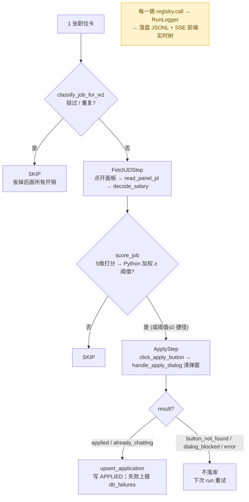

W1 看懂了，W2/W3 是同一套骨架（runner 装配 → pipeline 循环 → step → tool → registry 观测），只是业务换成"扫会话 / 分析意图 / 发回复"。第 7 章会顺着这套骨架讲 W2/W3 的不同之处（尤其是意图分析的"零 HR 消息守门"和 W3 的"重扫验证发送落地"）。

---

## 4. 浏览器自动化层（DrissionPage）

整套系统的"手脚"是浏览器层——它真的开一个 Chrome、登录 Boss、点按钮、读 DOM。这层的所有设计都围绕一个敌人：**Boss 的反爬检测**。

### 4.1 为什么是 DrissionPage 不是 Playwright

Playwright / Selenium 通过 CDP（Chrome DevTools Protocol）驱动浏览器，会在 `navigator.webdriver` 等处留下自动化指纹，Boss 能检测到并封。**DrissionPage 走的是不同路子**（直接接管一个真实 Chrome 进程，行为更接近真人），这是选它的根本原因。代价是它**同步、不支持 async**——所以整个项目是单线程同步的，不引入 async/await。

### 4.2 open_browser：怎么开一个"看起来像真人"的浏览器

`services/browser_context.py:83`。开浏览器远不止 `ChromiumPage()` 一行，它要处理"登录态持久化 + 残留清理 + 反爬伪装"三件事：

```python
def open_browser(data_dir: Path, headless: bool = True) -> ChromiumPage:
    profile_dir = data_dir / "browser_profile"        # ← 登录态就存这个 Chrome user-data 目录
    profile_dir.mkdir(parents=True, exist_ok=True)
    _kill_stale_chrome(profile_dir)                    # ① 杀掉占着这个 profile 的残留 Chrome
    for lock_path in [profile_dir/"LOCK", profile_dir/"Default"/"LOCK"]:
        try: lock_path.unlink()                        # ② 清崩溃留下的 LOCK 文件
        except OSError: pass

    options = ChromiumOptions()
    options.set_user_data_path(str(profile_dir))       # ③ 复用 profile = 复用登录态
    options.headless(headless)
    options.set_argument("--disable-blink-features=AutomationControlled")  # ④ 抹自动化指纹
    options.remove_argument("--enable-automation")
    options.set_user_agent("Mozilla/5.0 ... Chrome/124.0.0.0 Safari/537.36")  # 伪装真实 UA

    page = ChromiumPage(addr_or_opts=options)
    page.run_cdp("Page.addScriptToEvaluateOnNewDocument", source=_STEALTH_JS)  # ⑤ 每次导航前注入 stealth
    return page
```

`_STEALTH_JS`（`:16`）抹掉三个最常被检测的特征：`navigator.webdriver` 置 `undefined`、补一个假的 `window.chrome` 对象、把 `navigator.languages` 设成中文优先。用 CDP 的 `addScriptToEvaluateOnNewDocument` 注入，保证**每次页面导航前**都先跑，而不是只跑一次。

`_kill_stale_chrome`（`:25`）是踩坑换来的：上一轮 run 的 Chrome 没正常关（比如用户中途关窗口），会占着端口/profile 导致下一轮起不来。它用 `wmic` 查命令行里带我们 profile 路径的 `chrome.exe` 进程，`taskkill` 掉。

> **大坑（已记项目记忆）**：DrissionPage 4.1.x 的 `auto_port(True)` 会**忽略 `set_user_data_path`**、改用临时 profile，直接导致登录态丢失，表现为"浏览器一开就闪退 / session 立刻过期"。所以这里坚持 `set_user_data_path` + `_kill_stale_chrome` 组合，不用 `auto_port`。（注意：第 1 段会话里我截图 Dashboard 时**故意用** `auto_port(True)`——因为那是个一次性的、不需要登录态的独立浏览器，正好要它用临时 profile 不碰 Boss 登录态。同一个选项，两种场景，用途相反。）

### 4.3 登录态判定：唯一权威是 VerifySessionStep

新手最容易踩的认知坑：**登录态不在某个 `session.json`，而在 `data/browser_profile/` 这个 Chrome user-data 目录里**（`data/session.json` 是废弃占位）。判断"还登录着吗"的**唯一权威**是跑 `VerifySessionStep`（`pipeline/common/verify_session.py`）——访问个人推荐页，用 JS 读 `window._PAGE.name`：

```python
self._page.get(_PERSONAL_URL, timeout=20)          # geek/recommend 个人页
if "geek/recommend" not in self._page.url:          # 被重定向走 = 登出了
    return VerifySessionOutput(status=FAILED, reason="...", error="session_expired")
raw_name = self._page.run_js("return (window._PAGE && window._PAGE.name != null) ? ...")
if raw_name.strip():                                # 读到用户名 = 登录有效
    return VerifySessionOutput(status=SUCCESSFUL, username=...)
```

关键设计是**错误分流**（注释里有完整教训）：

- **确认登出**（被重定向离开个人页）→ `session_expired`，立即返回**不重试**（重试也没用，得人去重登）。
- **暧昧失败**（抛异常、或页面加载了但读不到用户信息）→ 重试一次，仍失败则报 `verify_error`，且 **reason 非空**，明确告诉调用方"这是浏览器/页面抖动，不一定是登出"。

这个区分是血泪史：以前一律报空 reason 的"session invalid"，结果一次 headless Chrome 启动抖动就误判 session 失效、中止了一个本来好好的 W1 run，害人空跑去重登（其实重登一下就过了）。

### 4.4 tools/browser 的操作惯用法

浏览器 tool 有几个反复出现的模式，看懂它们就能读懂任何一个 browser tool：

**① 多选择器兜底找元素** `_ele_any`（`tools/browser/helpers.py:5`）：Boss 的 DOM 在不同页面/版本下 class 名会变，所以关键元素都准备一组候选选择器，挨个试，第一个用给定 timeout 等、后续 timeout=0 立即试：

```python
apply_btn = _ele_any(page, _APPLY_BTN_SELECTORS, timeout=3)   # 见 click_apply_button
```

**② 拟人停顿** `_human_pause`（`:21`）：点击后随机 sleep 1.5~2.5 秒，模拟真人节奏，降低被反爬识别的概率。

**③ 查 SPA 动态节点必须用 run_js**（重要坑）：DrissionPage 的 `page.eles(...)` **查不到 SPA 动态渲染的子节点**（返回 0）。凡是动态列表/消息，一律改用 `page.run_js("document.querySelectorAll(...)")`。`count_resume_delivered_markers`（`helpers.py:38`）就是范例。

### 4.5 一个领域坑的标本：怎么确认"简历真发出去了"

`helpers.py` 顶部那段长注释（`:25`）是这套代码"验证结果而非动作"哲学的最佳标本。问题：点了"发简历"按钮，怎么确认真发出去了？

答案：**Boss 在简历真正送达后，会在聊天里插一个 `item-system` 系统气泡，文本含「附件简历」四个字**。这个系统气泡是简历送出的**唯一真相源**——两条发送路径（工具栏发 / 接受 HR 卡片）都会触发它，连 `detect_resume_request` 判断"是否已发过"也认它。而 HR 自己说的"发个简历"永远不含这四个字，所以不会假阳性。

```python
_RESUME_DELIVERED_KW_JS = "\\u9644\\u4ef6\\u7b80\\u5386"  # 「附件简历」，CJK 转义防 Windows GBK 损坏

def wait_resume_delivered(page, before, attempts=6, pause=1.0):
    for _ in range(attempts):       # Boss 异步渲染确认气泡，必须轮询重试
        time.sleep(pause)
        if count_resume_delivered_markers(page) > before:  # 数量比发送前多了 = 真送达
            return True
    return False
```

注意两个细节：① 关键词用 `\uXXXX` 转义而非裸中文——Windows GBK 工具链会静默损坏源码里的裸 CJK；② 必须**轮询重试**，因为确认气泡是异步渲染的，发完立刻查会查不到（这和 W3 验证发送、W1 等成功弹窗是同一类异步问题）。

> 更多 DrissionPage / 会话领域坑（`eles()`、`conv_id` 生成、弹窗假阳性、键盘 API 等）见项目记忆 `modules/browser-agent.md`。

---

## 5. LLM 层（ModelRouter + FallbackChain）

LLM 层（`services/llm_client.py`）的设计目标：**调用方不关心用的是哪个模型**。score_job、analyze_hr_intent 这些 tool 只说"我要 balanced 档的能力"，路由和容错由这层兜底。

### 5.1 两级抽象：ModelRouter → FallbackChain → Provider

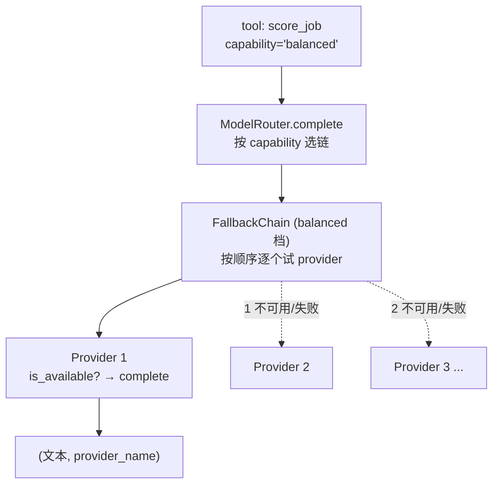

- **Provider**（`:16`–`:233`）：5 种具体后端，每个实现 `is_available()` + `complete(prompt, system)`：`ClaudeCLIProvider`、`CodexCLIProvider`、`OllamaProvider`、`AnthropicAPIProvider`、`OpenAICompatibleProvider`。
- **FallbackChain**（`:236`）：一组 provider 按顺序排队。`complete` 逐个试——不可用就跳过，抛异常就记下换下一个，直到有一个成功；全挂则抛 `AllProvidersFailedError`，错误信息区分"不可用"和"试了但失败"。
- **ModelRouter**（`:308`）：按 `capability`（fast/balanced/powerful）选用哪条链。config.yaml 的 `llm.capabilities` 给每档配一条 provider 列表。

```python
def complete(self, prompt, system="", capability="balanced", provider_name=None):
    if provider_name:                              # 调用方指定某 provider → 直连
        provider = self._find_provider(provider_name)
        try:
            if not provider.is_available(): raise RuntimeError(...)
            return provider.complete(prompt, system), provider.name
        except Exception as exc:
            logger.warning("Preferred provider failed; falling back to chain")  # 直连失败 → 退回链
    chain = self._chains.get(capability) or self._chains.get(self._default) or ...
    return chain.complete(prompt, system)          # 返回 (文本, 实际用的 provider 名)
```

返回值始终带上"实际用了哪个 provider"，这个 `provider_used` 一路传到日志和前端，可追溯（比如自检里那条 `provider=ollama_qwen3:8b`）。

### 5.2 Provider 各自的坑

每个 provider 的注释都记着一个具体踩坑，挑几个：

- **subprocess 一律 list 形式、绝不 `shell=True`**：prompt 内容（尤其 HR 消息）是**不可信输入**，`shell=True` 会让恶意文本注入 shell 命令。
- **CodexCLIProvider 的 `shutil.which`**（`:59`）：Windows 上 codex 是个 `codex.CMD` shim，`subprocess.run(["codex", ...])`（list 形式）找不到它会抛 FileNotFoundError；必须 `shutil.which("codex")` 拿到完整 `.CMD` 路径。而且 codex 用 `-s read-only` 锁死文件系统（因为 prompt 不可信），并标注它有 ~15k token 的固定开销、只当**应急兜底**，日常用 anthropic_api/openai_compatible 更便宜。
- **编码**：所有 CLI provider 都强制 UTF-8 解码（`PYTHONUTF8=1` / `encoding="utf-8"`），否则中文 JSON 在 Windows GBK 默认解码下会乱。

### 5.3 safe_parse_json：LLM 输出的三层容错

LLM 返回的"JSON"经常带噪声（套在 ```json 代码块里、中文引号没转义、尾随逗号）。`services/llm_parser.py:38` 用三层兜底把它救回来：

```python
def safe_parse_json(text, required_fields=None):
    extracted = _extract_json_candidate(text)      # 层1: 先抠 ```json``` 块，没有就找第一个 {...} 配平
    if not extracted: raise LLMParseError("No JSON content found")
    try:
        parsed = json.loads(extracted)             # 层2a: 标准解析
    except json.JSONDecodeError as e:
        if _has_json_repair:
            repaired = json_repair_func(extracted) # 层2b: json-repair 修中文引号/尾逗号等
            parsed = json.loads(repaired) if isinstance(repaired, str) else repaired
        if parsed is None: raise LLMParseError(...)
    if required_fields:                            # 层3: 字段类型强制；缺失→None，转换失败→None
        for name, typ in required_fields.items():
            ...
    return parsed
```

> 坑：`json-repair` 的导入名是 `from json_repair import repair_json`（不是 `repair`，包 API 变过）。

### 5.4 "models judge, code decides" 在这里的体现

这是全局原则，LLM 层是它的主战场。规则：**只让 LLM 做需要判断的事（分类、抽取、起草），确定性的事交给代码。**

`score_job`（第 3.5 节）是范本：LLM 只输出 5 个维度各自的分（judge），加权求和用 Python 写死的 `WEIGHTS`（decide）。`AnalyzeStep`（下一章）的"HR 到底有没有说话"也是代码判（`any(sender=='hr')`），不交给 LLM。这样做的好处是结果稳定、可复现、可单测，不会因模型一次"感觉"飘。

---

## 6. 数据库层（SQLite tracker 状态机）

所有状态的唯一真相源是 SQLite（`data/jobs.db`），统一走 `services/tracker.py` 的 `ApplicationTracker`。**禁止在端点或 tool 层直接写裸 SQL**——都走 tracker 方法。

### 6.1 三张表

`_create_tables`（`tracker.py:58`）：

- **`applications`**（`:62`）：投递记录。主键 `job_id`，含 `status`（状态机，见 6.3）、`score`、`applied_at` 等。
- **`hr_conversations`**（`:83`）：HR 会话。主键 `conv_id`，含 `stage`（会话阶段）、`intent`（LLM 分析的意图）、`reply_status` + `reply_text`（审批/回复状态机，见 6.4）、`last_msg_preview`（增量脏检查用）。
- **`hr_messages`**（`:107`）：逐条消息。`UNIQUE(conv_id, sender, text)` 做去重，重复扫描 `INSERT OR IGNORE` 不会重复落。

> 坑：Boss 的 SPA 会话**没有稳定唯一 ID**（`d-c` 属性全是用户自己的 ID），所以 `conv_id = sha256(hr_name|company)[:12]` 自己算。

### 6.2 并发模型：线程局部连接 + WAL

这是 DB 层最容易踩雷的地方。Dashboard 会**在 worker 线程里跑 W2**，同时 API handler（批准/取消回复）在事件循环线程上跑——两个线程都要碰 DB。单条共享连接被两个线程并发用会锁死或损坏。解法（`:47`–`:56`）：

```python
@property
def conn(self) -> sqlite3.Connection:
    c = getattr(self._local, "conn", None)         # 每个线程一条自己的连接
    if c is None:
        c = sqlite3.connect(self._db_path, check_same_thread=False, timeout=30)
        c.row_factory = sqlite3.Row
        c.execute("PRAGMA journal_mode=WAL")        # WAL：读写不互斥
        c.execute("PRAGMA busy_timeout=30000")      # 写锁冲突时等待而非立刻失败
        self._local.conn = c
    return c
```

**线程局部连接 + WAL + busy_timeout** 三件套：W2 run 期间发起的写会等锁（最多 30 秒）而不是直接报"database is locked"。这是真实修复——早期批准回复在 W2 跑的时候会因为写锁冲突失败。

### 6.3 投递状态机：只能合法跃迁

`applications.status` 不是随便改的，`VALID_TRANSITIONS`（`:12`）定义了合法跃迁图：

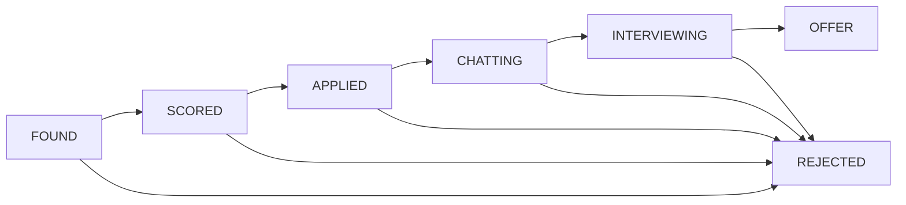

`_validate_transition`（`:157`）在每次改状态时校验：非法跃迁（比如 OFFER 退回 APPLIED）会被拒绝并 warning。`OFFER` 和 `REJECTED` 是终态（空集，出不去）。这保证状态**只能前进或拒绝**，不会被乱序的扫描结果倒推。

### 6.4 回复审批状态机：人审边界的载体

`hr_conversations.reply_status` 是 W2/W3 协作 + 人工审批的核心，流转是：

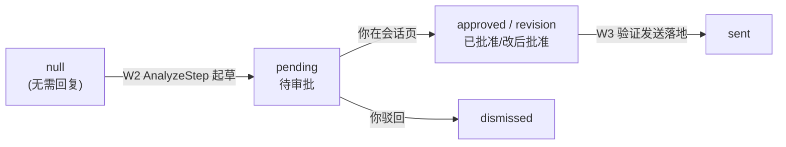

- W2 的 `AnalyzeStep` 给需要回复的会话写 `pending` + 草稿 `reply_text`。
- 你在 Dashboard 会话页 `approved`/`revision`/`dismissed`。
- W3 取 `approved`/`revision` 的发送，**验证落地后**才置 `sent`（见第 7 章）。

> 坑（已记记忆）：`update_hr_analysis` 的 CASE 保护必须覆盖所有终态（`approved`/`sent`/`dismissed`...），否则 W2 下一轮重新分析时会把 `sent` 覆写回 `pending`，导致 W3 重复发同一条回复。

---

## 7. W2 / W3 深入

W2/W3 和 W1 是同一套骨架（runner → pipeline → step → tool → registry 观测），这章只讲**不同之处**和几个关键设计。

### 7.1 W2 骨架：扫描 → 逐会话 → 收尾

`pipeline/w2/pipeline.py:23`，三段式：

```python
def run(self, config: W2Config) -> dict:
    scan_out = ScanStep(self._reg).run()                      # ① 扫会话列表 + 算增量
    conversations_to_process = scan_out.conversations_to_process[: config.max_conversations]
    for conv in conversations_to_process:                     # ② 逐会话处理
        out = ConversationPipeline(self._reg, self._profile, self._logger, config).run(conv, ...)
        convs_processed += 1; resumes_sent += int(out.resume_sent); stage_changes += int(out.stage_changed)
    FinalizeStep(self._reg, self._logger).run(...)            # ③ 收尾：状态同步 + 超时关闭
    return summary
```

对比 W1 的"滚动扫描循环"，W2 是"先一次性扫全量列表，再逐个处理"。注意 `for` 循环里包了 `try/except`（`pipeline.py:46`）——单个会话出错只记录后 `continue`，不让一个坏会话炸掉整轮。

### 7.2 ScanStep：增量脏检查（只处理有变化的会话）

`pipeline/w2/scan_step.py`。如果每轮都重读全部几百个会话，又慢又烧 LLM。所以 ScanStep 做**增量脏检查**：

1. 导航 + 滚动抓全量会话列表（带重试，空列表当瞬时失败重试 3 次，`:34`）。
2. `filter_conversations`（`:103`）对比每个会话**当前列表预览**和**上轮存库的预览**，只挑变了的（预览变 / 有未读 / 新会话 / 有待发回复）进 `conversations_to_process`。
3. 每会话的过滤决策 `filter_decision` 以 `visible=False` 只写文件日志（`:119`），不污染 SSE；按原因汇总的 `by_reason` 才推前端。

> 关键坑（`conversation_pipeline.py:148` 长注释）：存进库的 `last_msg_preview` 必须用**扫描时列表行的预览**，不能用进会话后读到的最后一条消息——两者是不同 DOM 源、截断长度不同，混用会导致两边永远对不上、每轮全量重处理。代价是刚回复过的会话下轮会被多处理一次（列表预览变成了我方消息），然后收敛。

### 7.3 ConversationPipeline：单会话的"导航→读→分析→(发简历)→落库"

`pipeline/w2/conversation_pipeline.py:60`：

```python
nav = W2NavigateStep(self._reg).run(conv)              # 点进这个会话
read = ReadStep(self._reg).run(conv_id=conv.conv_id)   # 读全部消息
analyze = AnalyzeStep(self._reg).run(conv=conv, messages=read.messages)  # LLM 分析意图（见 7.4）
# 按意图升级 stage（只升不降）
new_stage = INTENT_STAGE_MAP.get(intent, "active" if stage=="new" else stage)
if needs_resume and not already_sent_resume and not dry_run:
    res_out = ResumeStep(self._reg).run(...)           # 按需发简历
upsert = self._reg.call("upsert_hr_conversation", ..., stage=new_stage)  # 落库新 stage
```

**stage 只升不降**：`_stage_rank`（`:20`）给 `STAGE_ORDER`（new→active→resume_sent→interview→offer→closed）排序，只有候选 stage 排名更高才升级。这样乱序的扫描不会把"已面试"打回"活跃"。

### 7.4 AnalyzeStep 守门：零 HR 消息绝不起草回复

这是 W2 最重要的一个正确性修复（`pipeline/w2/steps/analyze.py:42`）。问题：有些会话里 **HR 一个字都没说**，只有我方自我介绍（+ 可能一条 Boss 平台提示）。如果照样调 LLM 分析意图，LLM 没 HR 的话可回，就会**臆造**一个"HR 在认可我"，起草"感谢您的认可…"的假回复。实测 67 条待审批里 45 条 HR 一字未回。

修复是一道确定性守门：

```python
det = self._reg.call("detect_resume_request", messages=messages)  # 简历检测先跑（认系统气泡）
has_hr_message = any(m.get("sender") == "hr" for m in messages)    # ← "HR 说话了吗" 是确定性事实
if not has_hr_message:
    # 没有 HR 消息：跳过整个 LLM 调用，intent=unknown，绝不起草回复
    return AnalyzeStepOutput(status=SUCCESSFUL, intent="unknown", needs_reply=False, ...)
intent_res = self._reg.call("analyze_hr_intent", ...)             # 有 HR 消息才调 LLM
```

"HR 有没有说话"是确定性事实 → **code decides**，不交给 LLM。注意 `detect_resume_request` 在守门**前**跑——它认系统气泡 + HR 卡片，真 HR 索要简历本身就是 hr 消息（那样 `has_hr_message` 会为真，走不到守门）。

> 还有一类污染源：Boss 平台提示「优秀竞争者会…」DOM 上带 HR 气泡 class，会被误标 `sender='hr'`。`read_messages._reclassify_platform_tips` 按文本前缀把它重分类成 system，避免污染意图分析。

### 7.5 W2 不发回复 + FinalizeStep 收尾

注意 `conversation_pipeline.py:143`：**W2 只理解和起草回复，不发送**。`reply_sent_flag` 恒为 `False`。发送被收口到 W3——因为旧的 W2 ReplyStep "标记已发但不验证送达"造过假成功。

`FinalizeStep`（`finalize_step.py:18`）做两件收尾：

- `sync_application_status_from_conversations`：把会话 stage 的进展同步回 applications 表的 status。
- `mark_timeout_rejections`：投递后超 `no_response_days`（默认 14）无回应 → 判超时拒绝；会话最后一条消息超 `stale_conv_days`（默认 14）无更新 → 判陈旧关闭。

### 7.6 W3：定位 → 发送 → 重扫验证 → 标记

W3（`pipeline/w3/`）是**唯一会以你名义给 HR 发消息**的流程，所以**只能手动触发**，且只发你审批过的回复。

`W3Pipeline`（`pipeline/w3/pipeline.py:26`）：取 `approved`/`revision` 的回复 → 导航到聊天列表 → 每条跑 `SendReplyPipeline`。核心在 `SendReplyPipeline`（`send_pipeline.py:54`）的四步，每步都有**显式完成检查**（不是"动作执行了"就算）：

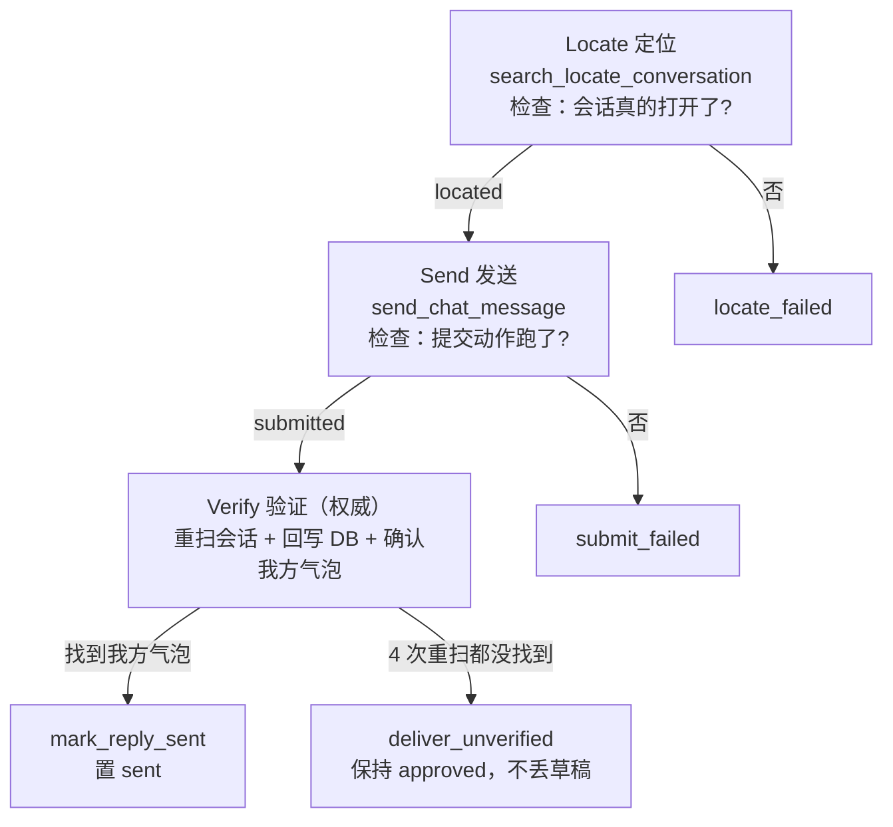

**Verify 是 W3 的灵魂**（`send_pipeline.py:88`）。它不看"打开会话时 DOM 里有没有我方气泡"（那会撞历史气泡假阳性），而是**发送后重扫**：

```python
probe = _norm(text)[:16]                            # 去空白取前16字符
for attempt in range(4):                            # Boss 异步渲染发出的气泡，重试 4 次
    rd = self._reg.call("read_messages")            # 复用 W2 的读消息 tool 重扫
    messages = rd.data.get("messages", [])
    if any(m.get("sender")=="me" and probe in _norm(m.get("text","")) for m in messages):
        out.delivered = True; break
    time.sleep(1.2)
if messages:
    self._reg.call("write_hr_messages", conv_id=conv_id, messages=messages)  # 回写 DB 留痕
if out.delivered:
    self._reg.call("mark_reply_sent", conv_id=conv_id)   # 只有验证过才 mark sent
else:
    out.failure_reason = "deliver_unverified"            # 否则保持 approved，草稿不丢
```

一举两得：既**验证了发送真落地**，又**把发出的消息回写进 hr_messages**（根治了 W3 发送从不同步消息表）。本质教训：**验证"动作做没做" ≠ 验证"结果发生没发生"**。旧 `verify_reply_delivered`（已删）run 日志 `duration_ms:1` 就是红旗——没等网络往返就命中，匹配的是历史气泡。

---

## 8. 前端 SPA（React + SSE live + 工作流监控 + 日志回放）

前端是 React 18 + Vite + Tailwind 的单页应用，源码在 `dashboard/frontend/`，`npm run build` 产物落入 `dashboard/static/`，由 uvicorn 直接服务。**约定：前端不改 `server.py`，`server.py` 只改 API 层**——两边通过 REST + SSE 解耦。

### 8.1 外壳与页面

`App.tsx` 是外壳：左 `Sidebar`（8 个导航）+ 顶 `Topbar` + 中间按 `page` 状态切换的页面（`pages/` 下 8 个 `.tsx`）。跨组件共享状态（当前页、`workflowRunning`、`progressEvents`、暂停态）通过 `app-context.ts` 的 React Context 下发，避免逐层 props。

### 8.2 前后端到底怎么交流：三条通道

前端不直接读 SQLite，也不 import Python。所有跨边界数据都经过 `dashboard/server.py`，但按生命周期分成三条通道：

| 通道 | 方向 | 适用场景 | 例子 |
|------|------|----------|------|
| **REST 请求/响应** | 前端 → 后端 → 前端 | 查询、保存、审批、短操作 | `GET /api/jobs`、`POST /api/conversations/{id}/approve-reply` |
| **REST 启动 + SSE 推送** | REST 负责下命令；SSE 负责后端持续上报 | W1/W2/W3 这种分钟级工作流 | `POST /api/workflow/apply` + `GET /api/workflow/stream` |
| **REST 历史回放** | 前端 → 后端 → 前端 | 页面刷新后查看完整旧 run | `GET /api/runs/{run_id}/events` |

这不是 WebSocket。SSE 是**后端到前端的单向长连接**；前端要启动、停止或修改东西，仍然发普通 HTTP。这个选择很贴合项目：控制命令很少，但进度事件很多，不需要双向长连接协议。

```mermaid
flowchart LR
    PAGE["React page/component"]
    API["src/api/index.ts<br/>API.* + requestJson"]
    HTTP["FastAPI endpoint<br/>dashboard/server.py"]
    CORE["tracker / service / runner / pipeline"]
    EMIT["ProgressEmitter"]
    SSE["useWorkflowStream<br/>EventSource"]
    CTX["App Context<br/>workflowRunning + progressEvents"]

    PAGE -->|"调用 typed API"| API
    API -->|"GET/POST/PUT/DELETE"| HTTP
    HTTP --> CORE
    CORE -->|"JSON response"| HTTP
    HTTP --> API --> PAGE
    CORE -->|"ProgressEvent"| EMIT
    EMIT -->|"SSE /api/workflow/stream"| SSE
    SSE --> CTX --> PAGE
```

部署时，FastAPI 同时提供 `/api/*` 和构建后的 `dashboard/static/`，所以浏览器使用相对地址 `/api/jobs` 就是同源请求，不需要额外 CORS。前端开发模式由 `vite.config.ts` 把 `/api` 代理到 `http://localhost:8765`，前端代码不需要区分开发/生产 URL。

### 8.3 API 契约层：`src/api/index.ts`

`dashboard/frontend/src/api/index.ts` 是前端访问后端的**唯一入口**，同时承担三件事：

1. 用 TypeScript interface 描述返回数据，如 `Job`、`Conversation`、`RunDetail`；SSE 的 `ProgressEvent` 定义在 `useWorkflowStream.ts`，再由 API 回放类型复用。
2. 把查询参数、JSON body、`FormData` 等传输细节封装成 `API.getJobs()`、`API.reviseReply()` 之类的业务方法。
3. 通过 `handleJson()` 统一处理 HTTP 错误。

```ts
async function requestJson<T>(input: RequestInfo | URL, init?: RequestInit): Promise<T> {
  const response = await fetch(input, init)
  return handleJson<T>(response)
}

getJobs: (status?: string, page = 1, pageSize = 20) => {
  const query = buildQuery({ status, page, page_size: pageSize })
  return requestJson<JobsResponse>(`/api/jobs${query}`)
},

reviseReply: (conv_id: string, draft: string) =>
  requestJson(`/api/conversations/${conv_id}/revise-reply`, {
    method: 'POST',
    headers: { 'Content-Type': 'application/json' },
    body: JSON.stringify({ draft }),
  }),
```

当前实际使用四种载荷：

| 载荷 | 前端写法 | 后端接法 |
|------|----------|----------|
| Query string | `URLSearchParams`，如 `?status=APPLIED&page=1` | FastAPI 函数参数 `status/page/page_size` |
| JSON body | `Content-Type: application/json` + `JSON.stringify` | 多数端点目前接 `body: dict` |
| 文件上传 | `FormData`，浏览器自动生成 multipart boundary | `UploadFile` / `File(...)` |
| SSE event | `EventSource` 自动接收 `data:` 帧 | `EventSourceResponse` 持续 yield |

这里的 interface 是**编译期契约，不是运行时校验器**：`requestJson<T>` 的泛型不会检查服务端实际 JSON。如果后端字段改名而前端类型没同步，TypeScript 仍可能被错误的类型断言骗过去。因此新增/修改端点时应同时检查：后端序列化字段、`api/index.ts` interface、页面消费方。

### 8.4 普通 REST：以职位列表和回复审批为例

职位列表是一条标准的“拉数据 → 渲染”链路：

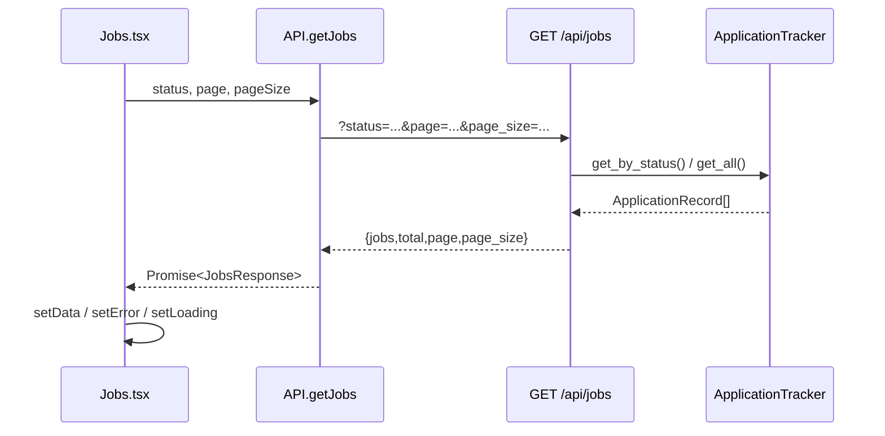

回复审批则展示了“乐观更新”：`Chat.tsx` 先把本地 `reply_status` 改成 `approved`，让按钮立刻响应，再发 `POST /api/conversations/{conv_id}/approve-reply`。如果请求失败，统一错误会进入 `catch`，页面调用 `loadConversations()` 从后端重新拉取，恢复真实状态。

后端错误约定由 `handleJson()` 收口：HTTP 非 2xx 时，优先读 JSON 的 `detail`，其次读 `error`，最后用 `statusText`，然后 `throw new Error(...)`。因此页面通常只需要：

```ts
API.getJobs(...)
  .then(setData)
  .catch((e: Error) => setError(e.message))
  .finally(() => setLoading(false))
```

### 8.5 长工作流：REST 只“启动”，SSE 才报告过程和结局

点击“开始投递”时，`WorkflowPanel` 调 `API.triggerApplyWorkflow(payload)`，发出 `POST /api/workflow/apply`。后端端点做的不是同步跑完整个 W1，而是：

1. 检查 `emitter.current_workflow`；已有任务则返回 `409`。
2. 立即把它设为 `w1`，关闭重复点击的竞态窗口。
3. 用 `BackgroundTasks` 注册真正的 `_run_apply_workflow()`。
4. 立即返回 `{"status":"started"}`。

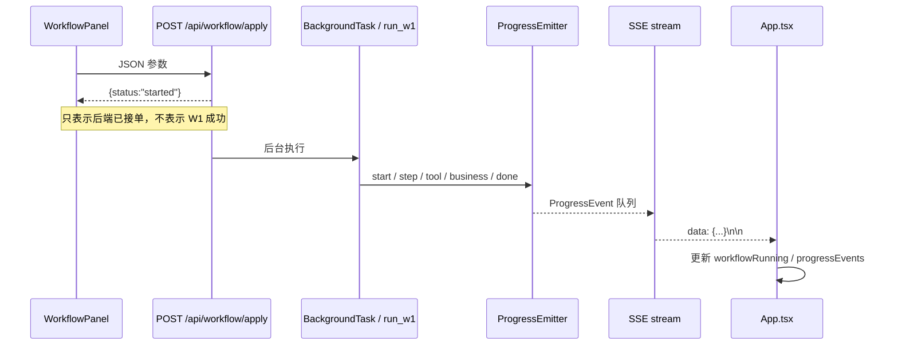

这是最容易误解的一点：**启动请求成功不等于工作流成功**。HTTP 已经返回后，后台才可能遇到 session 过期、反爬验证、LLM 错误等问题；这些错误无法再改写之前的 HTTP response，只能通过 `finish_workflow(..., status="error")`、SSE 和 run JSONL 告诉前端。

停止同样走控制面 REST：`POST /api/workflow/stop` 只调用 `emitter.request_stop()` 设置协作式停止标记并发一条 `stopping` 事件。它不是强杀线程；pipeline 在安全检查点看到标记后退出，最终 `done/error` 事件才代表实际结束。

### 8.6 实时数据流：从 `ProgressEmitter` 到 React

第 3.7 节讲了后端怎么 emit，这里补全前端怎么收。`ProgressEvent` 是两端共同遵守的数据形状：

```text
workflow  w1 / w2 / w3
step      当前阶段；start/done 是生命周期边界
tool      tool 级事件才有，step 级可为空
status    running / done / error / blocked / ...
message   人类可读摘要
scope     循环实例身份：W1 常用 job_id，W2 常用 conv_id/company
detail    结构化业务数据，如 score / intent / stage
ts        epoch 秒
```

服务端 `workflow_stream()` 订阅 emitter 队列，逐事件 yield：

```python
@app.get("/api/workflow/stream")
async def workflow_stream(request):
    q = emitter.subscribe()
    async def event_generator():
        while not await request.is_disconnected():
            try:
                event = q.get_nowait()
                yield {"data": json.dumps({...event 字段...}, ensure_ascii=False)}
            except queue.Empty:
                await asyncio.sleep(0.2)
    return EventSourceResponse(event_generator())
```

前端 `useWorkflowStream` 用 `new EventSource('/api/workflow/stream')` 订阅标准 `message` 事件，`JSON.parse(event.data)` 后交给 `App.tsx`；连接错误时关闭旧连接，2 秒后重连。格式损坏的单条事件会被忽略，不阻断后续流。

`App.tsx` 收到事件后做了一个**性能关键处理**：debug 模式下每个 tool 都推事件，逐条写 React state 会让整棵组件树高频重渲染。所以事件先放进 `pendingEventsRef`，每 200ms 批量 flush 一次，只在 `progressEvents` 保留最近 200 条；验证码 toast、`start/done` 状态同步仍即时处理。

后端也有缓冲，但语义不同：`ProgressEmitter` 为每个 workflow 各保留最近 200 条，新的 SSE 订阅者会收到各 workflow 缓冲按时间排序后的最近 400 条，用来在刷新页面后重建最近视图。订阅队列满时新事件会被丢弃，说明 SSE 是**实时展示通道，不是可靠消息队列**。

### 8.7 状态一致性：SSE 驱动，REST 轮询校准

`workflowRunning` 的权威来源是后端 `ProgressEmitter.current_workflow`，前端通过 `GET /api/workflow/status` 读取。同步策略是“双保险”：

- SSE 收到 `step=start` 或 `step=done` 时立即刷新状态。
- `App.tsx` 每 10 秒轮询 workflow 状态和 pause 状态，修复断线、漏事件或页面后台休眠造成的偏差。

所以 SSE 负责**低延迟体验**，轮询负责**最终校准**。页面组件只从 `AppContext` 消费 `workflowRunning` 和 `progressEvents`，不各自建立 SSE 连接，也不各自猜后端是否在运行。

这套方案仍有清晰边界：SSE event 没有 `run_id`，前端内存也只保留窗口数据，因此它适合“现在发生什么”，不适合审计“某次 run 完整发生了什么”。完整真相源是 `logs/runs/*.jsonl`。

### 8.8 WorkflowTrack：工作流监控

`components/workflow/WorkflowTrack.tsx` 是前端最复杂的组件之一。它把扁平的事件流重建成层级树展示：

- **tab 自动跟随**：`useEffect(() => { if (workflowRunning) setTab(workflowRunning) }, [workflowRunning])`——哪个工作流在跑就自动切到哪个 tab。
- **非循环 vs 循环分区**：按各 `pipeline.py` 的真实结构，把 `RUN_STEPS`（W1 的 scan、W2 的 scan/finalize 这类一次性阶段）和 `LOOP_STEPS`（每张卡/每个会话重复的阶段）分开。循环区是 master-detail：左边实例列表（每张卡/每个会话）可点选，右边显示选中实例的 step→tool 明细（默认跟随最新）。第 1 段会话截图里「逐会话循环 + 循环明细」就是这块。

> 坑（已记记忆）：`WorkflowTrack` 里的 `SKELETON`/`RUN_STEPS` 是**手维护的静态模板**，照着 `registry.call` 站点手抄的，**不是自动派生**——迁移步骤后会漂移（比如把发回复从 W2 迁到 W3，W2 骨架仍残留假 reply 步）。真实骨架的权威源是 run JSONL。

### 8.9 interpret.ts：把机器事件翻译成人话

`components/workflow/interpret.ts` 是**解读层**：原始事件（`{step:'job_scored', detail:{score:72, above_threshold:true}}`）经它变成中文一句话「评分 72（达标）」。它维护几张映射表（`STEP_LABELS`/`TOOL_LABELS`/`INTENT_LABELS`/`STAGE_LABELS`/`SKIP_REASON_LABELS`），`interpretEvent` 按事件类型查表 + 拼 detail：

```ts
case 'job_scored': {
  const tag = d.above_threshold === false ? '（未达标）' : '（达标）'
  return `评分 ${d.score ?? '?'}${tag}${d.reason ? ` · ${d.reason}` : ''}`
}
```

关键：**实时 SSE 和 JSONL 回放共用同一套 interpret**——所以"现在直播看到的"和"事后回放看到的"措辞完全一致。读"料"取自 `ev.detail`（业务事件带 score/intent/stage），不取机器味的 `message`。

> 前端 CJK 铁坑：TS/TSX 里中文必须 `\uXXXX` 转义（Windows GBK 工具链 + Prettier 会损坏裸中文），所以你看 `interpret.ts` 源码里全是 `评分` 这种——渲染出来才是「评分」。JSX 属性字符串（`label="中文"`）更要改成表达式 `label={'中文'}`，否则渲染成字面量乱码。

### 8.10 日志回放：让"过去的 run"也能看

监控只覆盖 live + 最近缓冲窗口（跑完 `current_workflow` 会回 idle，但最近事件仍可短期重建）。要看完整历史 run，靠「日志」页（`pages/Logs.tsx`）+ 两个端点：

- `GET /api/runs`：列出所有 run（扫 `logs/runs/*.jsonl`）。
- `GET /api/runs/{id}/events`：`_parse_run_events`（`dashboard/server.py`）把那条 run 的 JSONL **摊平成前端 ProgressEvent 形状**，于是回放能复用 WorkflowTrack 同一套 `buildTree` 渲染。

```python
def _parse_run_events(path):
    # run_start → step='start'；run_end → step='done'；step/tool 原样；business event → status='info'
    # 跳过 visible=False 的（如 filter_decision）→ 回放镜像直播视图，不冒出被过滤掉的幻影实例
    # 领域 status → UI status（_ui_status，单一来源）；ISO 时间 → epoch 秒
```

为什么需要它：前端内存只保留最近 200 条；后端虽按 workflow 各缓冲 200 条用于重连恢复，但仍会截断且进程重启即失——**它们都显示不了一条完整的过去 run**。而 JSONL 是完整落盘的，所以**持久化 JSONL 才是 run 的完整真相源**，SSE buffer 只是直播缓冲。

---

## 9. 可观测性 + 配置三层模型 + 自检 / 简历模块

最后把几个横切主题串起来。

### 9.1 可观测性：一次写入，两路输出

观测信号从 pipeline 出来，经一个**适配器**双写：

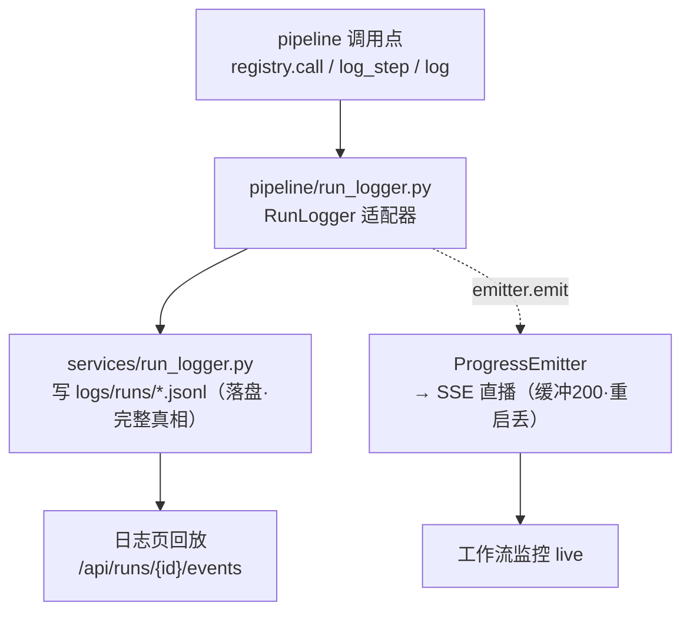

- `pipeline/run_logger.py` 是**适配器**：每个 `log_step`/`log_tool`/`log` 都同时①调 `services/run_logger.py` 写 JSONL，②（按 debug/visible 门控）`emitter.emit` 推 SSE。
- 两路的**门控不同**：JSONL 全量落（含 `visible=False` 的 `filter_decision` 这类纯调试 trace）；SSE 受 `debug` + `visible` 双门控（tool 级事件只在 debug 模式推，免得洪水）。
- **领域词 vs UI 词**：文件日志保留 `successful/failed/degraded`（分析精度），推 SSE 时经 `_ui_status` 映射成前端认的 `done/error/skipped`，否则前端把 `successful` 当未知值渲染成"等待"。

一句话记忆：**JSONL 是完整录像（事后回放权威），SSE 是实时直播（缓冲有限、重启即失）。**

### 9.2 配置三层模型

配置按"所有权"分三层（完整说明见 [`configuration.md`](configuration.md)）：

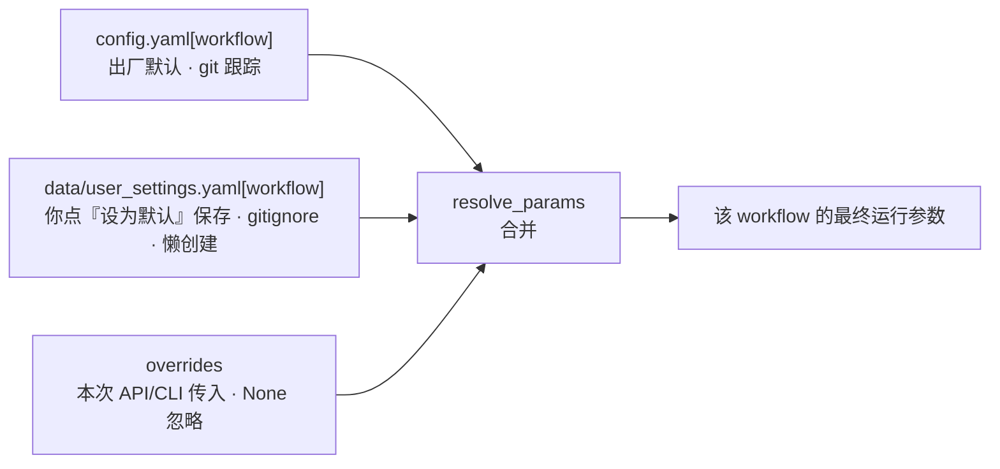

`services/settings_resolver.py` 实现，就两个核心函数：

```python
def resolve_params(workflow, overrides, config, data_dir):
    merged = dict(config.get(workflow, {}))                          # 出厂默认
    merged.update(load_user_settings(data_dir).get(workflow, {}))    # 用户默认（文件不存在则 {}）
    merged.update({k: v for k, v in overrides.items() if v is not None})  # 本次 override（None 不覆盖）
    return merged

def save_user_default(workflow, updates, data_dir):  # 前端"设为默认"按钮调
    # 部分写入 user_settings.yaml[workflow]，只动 updates 里的键
```

两个要点：① **`None` 不覆盖**——前端只传用户显式改的键，其余交给下层默认；② **懒创建**——没点过"设为默认"时 `user_settings.yaml` 根本不存在，直接吃出厂默认。注意求职偏好（关键词/城市/阈值）是另一条线：存 `data/profile.yaml`，优先于 config.yaml。

### 9.3 自检模块：复用真组件探活

`services/selfcheck.py`。设计原则：**每个探针复用真实组件，不另写一套**——这样探针挂了就直接指向坏掉的那层。

```python
def _probe_browser_session(data_dir):   # 复用 open_browser + VerifySessionStep
    page = open_browser(data_dir, headless=True)
    out = VerifySessionStep(page).run()
    return (True, f"已登录：{out.username}") if out.status==SUCCESSFUL else (False, out.reason)
def _probe_db(tracker):      return True, f"应聘 {len(tracker.get_all())} 条 · 会话 {len(tracker.get_hr_conversations())} 条"
def _probe_llm(model_router): text, provider = model_router.complete("Reply with the single word: OK", capability="balanced"); ...
```

三探针无副作用（浏览器 headless 开了就关、DB 只读、LLM 一个超短 prompt）。第 1 段会话里我触发的探针返回的 `已登录：浮瓜` / `应聘 648 条 · 会话 742 条` / `provider=ollama_qwen3:8b · reply=OK` 就是这三个。

**完整自检周期**（`server.py:_run_selfcheck_cycle`）= 探针 + 真跑一轮 W1（默认 10 卡）+ 真跑 W2（默认 300 会话），**绝不含 W3**——W3 会发回复，纳入无人值守自检就违背了"发送必须人审"的边界。调度器为它加了第三类 job（默认 12h），与 W1/W2 定时任务并列。**因为真跑的是 `_run_apply_workflow`/`_run_check_workflow`，所以自检的 W1/W2 同样推 SSE，监控能看到**（第 1 段会话验证过）。

### 9.4 简历模块：积木化 + 岗位定制 + Chromium 导出 PDF

两个 service 配合：

- **`resume_blocks.py`**：把"简历 + 自我描述"用 LLM 解析成**可排列组合的段落块**。`BLOCK_CATEGORIES = ["education","internship","project","skills","awards"]` + `_BASIC_FIELDS`（name/phone/email/...）。`build_blocks` 调 LLM 分类 + 逐块摘要，存 `data/resume_blocks.yaml`。前端「简历」页是 FlowCV 式编辑器，可手动增删改排序。
- **`resume_tailor.py`**：针对单个职位生成定制简历/招呼语。`match_template` 按 JD 关键词匹配预制模板（`resume_templates.yaml`），LLM 从积木库**挑选/排序/微调（不杜撰）**，产出存 `resume_plans.yaml`（按 job_id）。

PDF 导出有个值得讲的工程决策——`render_html_to_pdf`（`resume_tailor.py:199`）用 **Chromium CDP `Page.printToPDF`**（起一次性无头浏览器，端口 9920）而**不是 WeasyPrint**：

```python
def render_html_to_pdf(html, out_path, port=9920):
    # 一次性无头 Chromium 渲染 HTML → CDP printToPDF
    res = page.run_cdp("Page.printToPDF", printBackground=True)
```

原因：WeasyPrint 在 Windows 上 pip 能装但运行期缺 GTK 系统依赖（libgobject-2.0-0）不可用；而 Chromium 本来就有（DrissionPage 已经在用），用它渲染零额外系统依赖。**这是"约定优先 + 复用已有基建"的体现**：既然项目已经驱动 Chromium，PDF 也交给它，不引入装不上的新依赖。

> 简历功能③（自动发送）尚未实现：招呼语规划走"W1 投递成功 → 生成 → 审批 → W3 发送"，简历附件上传待调研 Boss 的上传机制。

---

## 结语：怎么继续读这套代码

读完九章，你应该已经有了这套系统的完整心智模型。继续深入时的建议路径：

1. **改任何东西前先 grep 消费方**（谁读它、谁写它）——本项目重构后残留过死字段/断链配置，看到 `'X' is required` 别急着填值绕过，先查 X 被谁消费。
2. **跟着一条真实 run JSONL 读**（`logs/runs/*.jsonl`）——它是流水线骨架和数据流的最权威记录，比任何文档都不会过时。
3. **善用监控的「日志」页回放**——把一次 run 的 event 流摊开看，对照本教程的调用链。
4. **专题深挖**看 `docs/` 下的 [`configuration.md`](configuration.md)（配置审计）、[`browser-session-convergence.md`](browser-session-convergence.md)（浏览器层收敛史）、[`frontend.md`](frontend.md)（前端细节），以及项目记忆里的 DrissionPage/W2 领域坑。

> 本教程描述的是 `v2.0.1.7` 时间点的实现。代码会演进，行号会漂移——**以函数名/类名定位，以 run JSONL 为准**。发现教程与代码不符时，相信代码，并更新本文。
