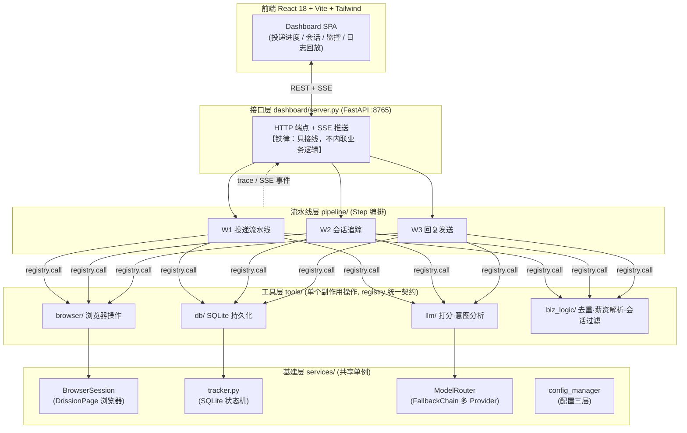
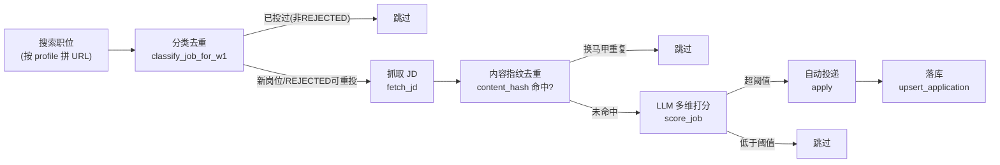
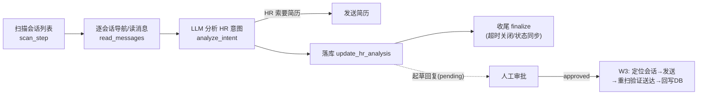
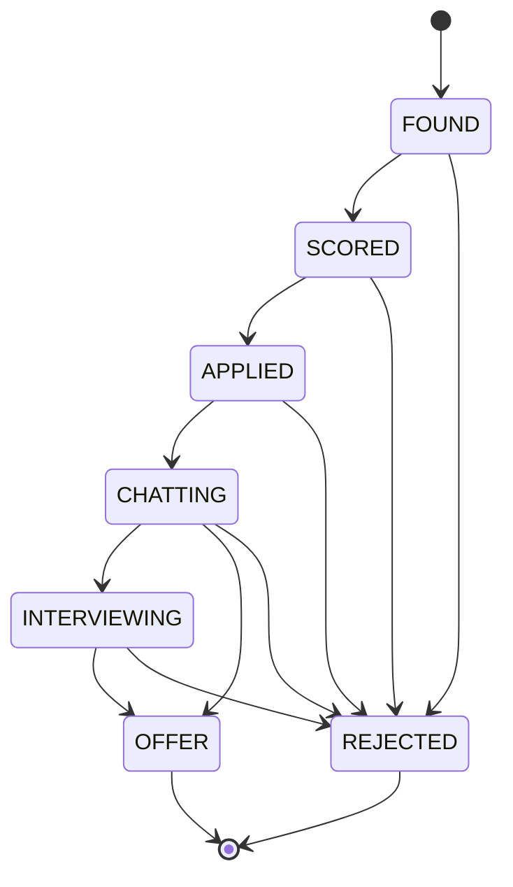

# 面试准备 — 富途 FUTU 金融测试岗

> 用途：把 OpenJobFinder 这个项目，翻译成金融测试岗面试官想听的能力。
> 面试前建议：亲手把「状态机表」和「W1/W2 两条流水线」在纸上默画一遍——白板上最能镇场。

---

## 0. 电梯陈述（一句话讲清项目）

> 我独立做了一个 Boss直聘 自动化求职 Agent。它模拟真实求职者的完整链路——搜索职位、用大模型多维度打分决策、自动投递、再同步 HR 会话追踪进展。技术上是 Python + 浏览器自动化 + LLM + SQLite 状态机 + FastAPI/React 实时看板。**它本质上就是一个跑在真实交易式链路上的自动化系统**：有状态流转、有幂等防重、有数据一致性校验、有全程可观测。

最后半句是故意埋的钩子——把「求职自动化」翻译成「交易系统测试」面试官听得懂的语言。

---

## 1. 整体架构

### 1.1 分层与数据流

**四层职责（可测试架构的核心）：**

| 层 | 职责 | 类比测试概念 |
|----|------|------|
| `tools/` | 对浏览器/DB/LLM 的**单个副作用操作**，统一契约、自动 trace/SSE | 最小可测单元 |
| `pipeline/`（Step） | 把多个 tool 编排成**工作流的一个阶段** | 集成测试的一条链路 |
| `services/` | 共享基建单例（浏览器会话、状态机、LLM 路由、配置） | 被复用的基础设施 |
| `server.py` | 只做 HTTP 接线，**不准内联业务逻辑** | 接口层 |

**加分话术**：我定了一条铁律——端点不准内联浏览器/LLM/业务逻辑，必须委托给 tool/step。因为踩过坑：交互端点曾内联一套遗留浏览器逻辑，和流水线的会话校验分叉，导致登录态误报「过期」。**两份分叉实现，加固一个漏一个**。这让我理解为什么测试里最怕「同一个逻辑有两份实现」。

### 1.2 W1 投递流水线

### 1.3 W2 会话追踪 + W3 回复发送

---

## 2. 四个技术亮点（金融测试官会眼睛一亮）

### 2.1 状态机 + 合法状态流转校验 —— 对标订单/交易状态测试

`services/tracker.py` 里有一张显式的合法迁移表 `VALID_TRANSITIONS`：

**话术**：投递流程本质是个状态机，和订单交易的「待成交→部分成交→全部成交→已撤单」一模一样。我用一张显式的合法迁移表挡住非法跳转（比如不允许 FOUND 直接跳 OFFER）。我还踩过一个真 bug——某个 SQL 的 CASE 保护漏了 `sent` 终态，导致已发送的回复被重新分析后覆写回 `pending`，**重复发送**。这就是典型的「终态被非法回退」缺陷，在金融里就是「已结算的订单不能被改回未结算」。

### 2.2 幂等 + 去重 —— 对标交易防重、对账

- **幂等保护**：per-job 原子操作，崩溃后靠 carryover 恢复现场。
- **内容指纹去重**：Boss 会轮换 `encryptJobId`（同一岗位每次搜索 ID 整串都变），单按 ID 去重会**重复投递**。改成算 `content_hash = sha256(标题|公司加密ID|JD正文)`，识别「换了马甲的同一岗位」。

**话术**：本质是**去重维度选错了**——主键会变，得找业务上真正稳定的指纹。金融对账一样：同一笔交易可能有多条流水，不能只按流水号去重，要按业务要素组合。

### 2.3 「验证动作做没做 ≠ 验证结果发生没发生」—— 测试断言的灵魂

早期「回复送达验证」有假阳性 bug：发完消息立刻在页面找「含回复前缀的我方气泡」，结果匹配到**历史的旧气泡**，误报成功（日志里 `duration_ms:1` 是红旗——还没等网络往返就命中，说明匹配的是已存在的东西）。

正解：发送后**重新扫描**会话、重试等异步渲染、确认**新**消息真的落地，并回写 DB 留痕。

**话术**：这是我对测试理解最深的一课——验证「我调用了发送接口」不等于验证「消息真的送达了」。很多人的自动化测试停在「接口返回 200」，但真正的断言应该校验最终业务状态。放到交易场景：不能只验证「下单请求发出去了」，要验证「订单真的进了撮合、资产真的扣减了」。

### 2.4 全链路可观测 + 日志回放 —— 对标 JD 的「流量回放」

每一步 tool 调用统一走 registry，自动记 trace、通过 SSE 实时推到 React 看板；所有运行落成持久化 JSONL，可 `/api/runs/{id}/events` **回放**整条已跑过的流水线。

**话术**：JD 提到流量回放——我项目里已有它的雏形：每次运行的完整轨迹落成 JSONL，可事后逐步回放复现问题。可观测性是自动化测试能定位问题的前提，不可观测的自动化只会掩盖 bug。

---

## 3. 把项目经验逐条翻译成 JD 能力

| JD 要求 | 用项目怎么答 |
|---------|--------------|
| 实时交易链路、清结算测试 | 状态机驱动的多阶段流水线（W1/W2/W3），理解每阶段前置/后置状态，与交易→清算→结算的多阶段状态流转同构。 |
| 订单/风控/资产结算准确性 | 状态流转合法性校验 + 幂等防重 + 内容指纹去重 + 「终态被非法回退」真实缺陷。 |
| 设计测试用例、模拟投资者行为 | 整个 Agent 就是在模拟真实求职者的行为序列；天然做行为建模和边界设计（空 HR 消息的会话绝不能起草回复、平台系统提示不能误判成 HR 消息）。 |
| 自动化测试 | 浏览器自动化（DrissionPage）+ 288 个 pytest 单测/集成测试，测试守门（绿了才算完成）。 |
| 流量回放 | JSONL 全量落盘 + 回放端点。 |
| AI 赋能测试 | **models judge, code decides**：只有真正需要判断的（打分、意图分析）才交给 LLM，路由/状态/重试用代码；LLM 输出三层容错解析（代码块提取→json.loads→json-repair 兜底）。知道 AI 该用在哪、不该用在哪、怎么处理不确定输出。 |
| Python / 网络协议 / 数据库 | Python 3.11 全栈；SQLite 用 WAL + 线程局部连接 + busy_timeout 解决并发写锁；浏览器自动化本身在跟 HTTP/DOM/异步渲染打交道。 |
| 快速学习、好奇心 | 从零自学 DrissionPage、SSE、React、LLM 路由，踩坑都复盘记录。 |
| 逻辑清晰、细致 | fail-fast、暴露冲突而非兼容两套、每个 bug 都追根因不猜着绕过。 |

---

## 4. 面试高频问题 + 参考答话

**Q：你没有金融/测试的正式经验，凭什么胜任？**
> 承认没有券商实操经验，但项目给了金融测试最核心的三块底层能力：状态流转校验、数据一致性/幂等、结果断言的严谨性。金融业务知识可快速补，但「validate 动作 ≠ validate 结果」这种测试直觉是靠踩坑长出来的。

**Q：讲一个印象最深的 bug。**
> 讲 2.3（回复送达假阳性）或 2.1（状态机终态被覆写重复发送）。这两个「金融味」最浓。

**Q：你怎么保证代码质量 / 怎么测你自己的项目？**
> 测试守门是硬规则——每次改完必须 pytest 全绿。288 个 unit + integration 测试。对不确定的外部依赖（浏览器/LLM）把副作用收敛到 tool 层、统一契约，才可测、可 mock、可观测。

**Q：为什么用 LLM？它不可靠怎么办？**
> models judge / code decides + 三层解析兜底 + 结构化输出（强制 LLM 返回 5 维度独立分数，Python 端加权，不让 LLM 做整体判断）。

**Q：这个项目最大的技术难点？**
> 绕过反爬的浏览器自动化 + SPA 动态 DOM 无稳定 ID（会话用 `sha256(hr_name|company)` 造 ID）；或单进程里 Dashboard 线程和 API 线程并发写 SQLite 的锁问题（线程局部连接 + WAL + busy_timeout）。

---

## 5. 诚实的短板 + 怎么应对

- **确实没做过金融清结算业务** → 承认，强调可迁移的测试底层能力 + 学习意愿（JD 明确「更看重快速学习」）。
- **项目是「自动化开发」不是「测试岗」** → 重构叙事：自动化测试和自动化 Agent 是同一套技能——都要驱动真实系统、断言真实结果、处理异步和不确定性。
- **被问 CFA/交易经验** → 如实说；若有实盘交易/期权经历一定要讲，换成「对交易有真实兴趣」。

---

## 6. 技术栈速查（被追问时不卡壳）

| 层级 | 技术 |
|------|------|
| 语言 | Python 3.11+ |
| 浏览器自动化 | DrissionPage（同步，绕过 CDP 反爬；非 Playwright） |
| LLM | ModelRouter + FallbackChain（claude_cli / codex_cli / ollama / anthropic_api / openai_compatible），按 capability 路由 |
| 数据库 | SQLite（WAL + 线程局部连接 + busy_timeout） |
| 后端 | FastAPI + uvicorn（:8765），SSE 推送进度 |
| 前端 | React 18 + Vite + Tailwind CSS v3 |
| 配置 | YAML 三层模型（系统配置 / 用户偏好 / workflow 运行参数） |
